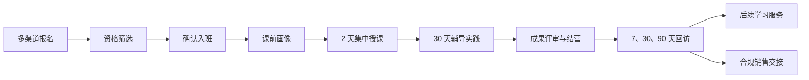

# AI 公开课学员跟进系统

面向 AI 公开课和训练营的学员全生命周期跟进系统，覆盖报名筛选、学习服务、困惑答疑、成果评估、定期回访和后续转化。

> 当前仓库处于需求设计阶段，尚未包含可运行的应用代码。

## 项目目标

系统计划将分散在报名表、飞书多维表格、企业微信、腾讯会议和人工回访中的信息统一沉淀为学员档案，并形成可追踪的服务闭环。

目标优先级为：

1. 提升完课率和学习效果。
2. 提升运营、班主任、讲师和助教的协作效率。
3. 在不干扰教学体验的前提下支持后续商业转化。

## 业务流程



## 规划能力

- 多渠道报名归因、资格筛选、确认入班和候补培育。
- 单课程、多班期管理，以及 40–60 人服务小组和主负责人分配。
- 渐进式学员档案、结构化学习诉求和跨班期学习记录。
- 腾讯会议出勤同步或文件导入，以及学习参与度跟踪。
- 微信内 H5 和企微群内提问，AI 草拟、人工审核的答疑流程。
- 基于规则的学习风险预警、AI 摘要和人工干预任务。
- 真实场景成果提交、AI 初评、人工定稿和结业判定。
- 课前基线、结营评估和结课后 7、30、90 天回访。
- 个人进阶课程和企业服务的轻量销售管线。
- 企业资料隔离、AI 数据分级路由、授权管理和操作审计。

## 用户角色

系统规划支持以下八类角色：

- 管理员
- 课程运营
- 招生顾问
- 班主任
- 讲师
- 助教
- 学员
- 企业观察员

各角色除功能权限外，还需受到班期、服务小组、企业空间和敏感字段等数据范围限制。

## 当前文档

- [AI 公开课学员跟进系统方案](docs/ai-open-course-student-followup-plan.md)：包含产品目标、角色权限、业务流程、核心需求、系统协作、AI 治理、隐私合规、MVP 边界和验收场景。

## 项目结构

```text
.
├── README.md
├── LICENSE
└── docs/
    └── ai-open-course-student-followup-plan.md
```

## 当前阶段

当前工作重点是验证需求和外部集成条件，包括：

- 企业微信群内 `@机器人` 建单能力。
- 企业微信会话内容存档的授权、费用和接口限制。
- 腾讯会议企业版开放接口能力。
- AI 模型供应商的数据留存、训练使用和删除政策。
- 飞书多维表格历史数据的字段质量与迁移范围。

计划中的 MVP 开发周期为 8–12 周，优先交付学员档案、班期运营、答疑、风险干预、成果评估和回访组成的学习服务闭环。

## 贡献方式

提交需求或修改文档时，请确保：

- 变更直接服务于已确认的产品目标。
- 新增流程同时说明角色、状态、异常处理和验收条件。
- 不提交学员个人信息、企业私有资料、访问令牌或其他凭据。
- 对外部平台能力的描述有实际验证依据，并保留不可用时的兜底流程。

## 许可证

本项目采用 [Apache License 2.0](LICENSE)。
