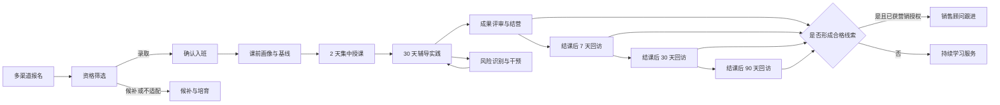
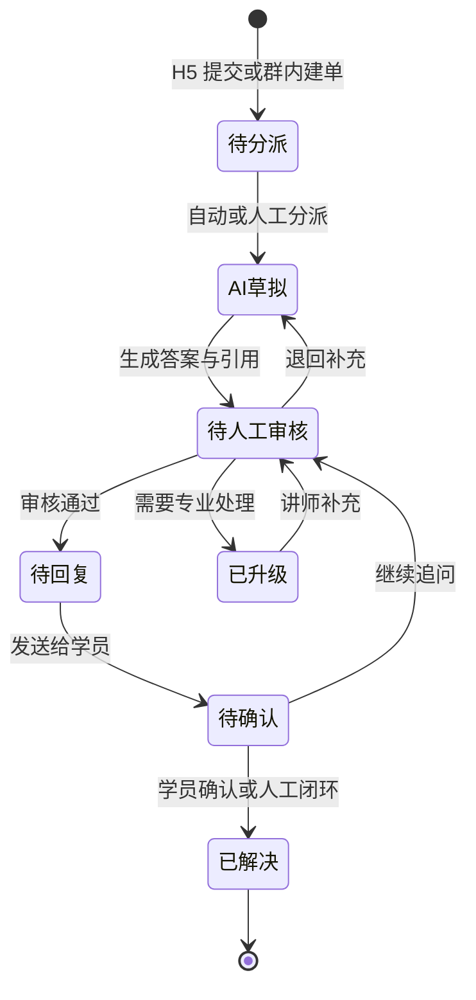
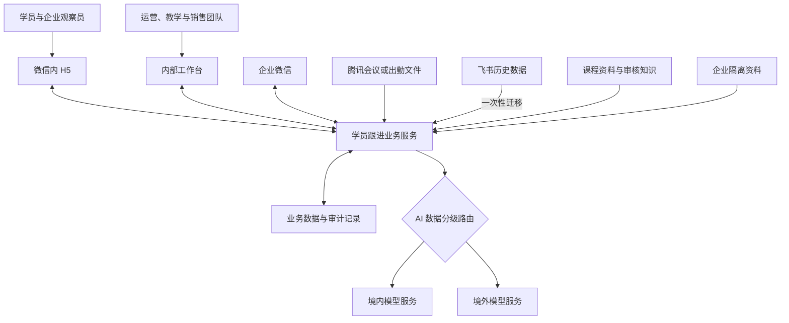

# AI 公开课学员跟进系统方案

## 1. 文档信息

| 项目 | 内容 |
| --- | --- |
| 产品定位 | 自有培训机构内部使用的 AI 公开课学员跟进系统 |
| 课程结构 | 单课程、多班期 |
| 典型班期 | 2 天集中授课 + 30 天企业微信群辅导 |
| 单班规模 | 100–500 人 |
| MVP 周期 | 8–12 周 |
| 目标优先级 | 学习效果 > 团队协作 > 商业转化 |
| 主要终端 | 内部桌面工作台、学员微信内 H5 |

## 2. 产品目标

系统需要把分散在报名表、飞书多维表格、企业微信、腾讯会议和人工电话中的信息汇总成统一学员档案，形成从报名到长期回访的可追踪闭环。

### 2.1 核心目标

1. 提升学习效果：及时识别学习障碍，完成答疑和人工干预，推动学员形成真实场景的 AI 落地成果。
2. 提升团队协作：明确负责人、服务时限、任务状态和交接记录，降低遗漏和重复跟进。
3. 支持商业转化：在学习服务完成的基础上，识别个人进阶课程和企业服务机会，形成克制、合规的销售跟进。

### 2.2 成功原则

- 学习服务优先于销售转化，不以营销行为干扰教学体验。
- AI 只提供草稿、初评、摘要和建议，面向学员的关键内容由工作人员确认。
- 自动采集失败时必须有人工录入或文件导入兜底。
- 敏感数据按最小必要原则采集、使用、授权和保留。
- 首 3 个班期用于建立真实基线，不凭空设置团队绩效目标。

## 3. 用户与权限

系统采用基于角色和数据范围的权限控制。除角色权限外，还需限制可访问的班期、服务小组、企业空间和敏感字段。

| 角色 | 主要职责 | 默认数据范围 |
| --- | --- | --- |
| 管理员 | 账号、角色、权限、系统配置、审计与数据治理 | 全局，敏感操作需审计 |
| 课程运营 | 班期配置、报名审核、分班、内容维护、通知和报表 | 被授权课程及全部班期 |
| 招生顾问 | 处理已授权的销售线索和后续跟进 | 分配给本人或团队的线索 |
| 班主任 | 管理服务小组、确认预警、组织干预、交接销售线索 | 负责班期和服务小组 |
| 讲师 | 审批课程内容、处理专业问题、定稿成果评审 | 被授权班期及教学内容 |
| 助教 | 日常答疑、问题转派、成果初审、学习跟进 | 负责班期和服务小组 |
| 学员 | 补充档案、提问、提交成果、填写反馈和查看本人记录 | 本人数据及获授权的共享内容 |
| 企业观察员 | 查看本企业团队的汇总学习进度、成果和风险 | 经成员授权的企业汇总数据 |

企业观察员不得查看私人问答、个人销售意向、匿名反馈原文或其他企业的数据。招生顾问默认不得访问企业私有资料和与销售无关的学习困惑原文。

## 4. 学员生命周期

### 4.1 生命周期状态

- 报名状态：待补充、待审核、录取、候补、不适配、已取消。
- 入班状态：待确认、已确认、未确认、已分班、已退班。
- 学习状态：未开始、集中授课中、辅导中、待评估、已结营、中止。
- 结业状态：未评定、达标、未达标、延期补交。
- 回访状态：未到期、待执行、进行中、已完成、无法联系、已退订。
- 销售状态：待确认、已分派、沟通中、方案评估、赢单、流失、暂缓。

所有状态变更均需记录操作人、时间、原因和来源；系统自动变更需标记触发规则。

## 5. 核心业务需求

### 5.1 报名、归因与入班

- 支持落地页、公众号、社群、转介绍等多渠道报名，并记录渠道、活动和推荐关系。
- 报名阶段只采集联系方式和基本画像，开营前再补充学习诉求、AI 基础、岗位场景和期望成果。
- 系统根据资料完整度、目标匹配度和出席承诺给出筛选建议，由课程运营最终确认录取、候补或不适配。
- 学员确认出席后才能正式分班；未确认者进入候补或培育池。
- 支持个人报名和企业团体报名，并将企业成员关联到独立企业空间。
- 使用手机号、企业微信外部联系人标识和人工确认完成重复学员识别，保留跨班期学习历史。

### 5.2 班期与服务分组

- 课程结构为单课程、多班期，标准课程模板包含日程、任务、问卷、提醒、评审量表和回访计划。
- 运营可以对单个班期进行有限覆盖，所有调整需保留版本和生效时间。
- 单班支持 100–500 名学员，默认按 40–60 人建立服务小组。
- 每名学员必须有一个服务小组和主负责人，专业问题可转派给讲师或其他助教。
- 支持批量分班、批量分配负责人、批量提醒和异常学员优先队列。

### 5.3 学员档案与学习诉求

- 档案包含身份与联系方式、渠道来源、职业和企业画像、AI 基础、学习目标、岗位场景、期望成果、授权状态和历史班期。
- 学习诉求采用结构化标签和自由描述并存，保留学员原始表达。
- 学习过程中持续沉淀出勤、互动、提问、答疑、成果、评审、风险、干预、反馈、回访和销售交接记录。
- 档案展示时间线，支持按类别筛选，但不同角色只能看到授权范围内的信息。

### 5.4 出勤与学习参与

- 优先从腾讯会议同步参会人、入会时间、离会时间和累计时长。
- 在腾讯会议开放接口不可用时，支持导入会议导出的 CSV 并进行身份匹配和异常校验。
- 允许助教人工修正未匹配记录，所有修正必须保留原始值和操作日志。
- 结业出勤标准为 2 天集中授课累计出勤不低于 80%。

### 5.5 困惑解答

- 学员可通过微信内 H5 提交正式问题，也可在企业微信群内 `@机器人` 自动创建问题单。
- 群机器人能力未验证或不可用时，允许助教将群消息人工转换为问题单。
- 问题单包含学员、班期、问题正文、附件、分类、紧急度、负责人、知识范围、处理状态和服务时限。
- AI 基于已授权知识生成答案草稿和引用来源；讲师或助教审核、编辑后才能发送。
- 集中授课期要求 30 分钟内首次响应；30 天辅导期服务时段为每日 9:00–21:00，要求 4 小时内首次响应，复杂问题 24 小时内闭环。
- 临近超时和已超时问题自动提醒负责人，并按“助教、班主任、讲师”路径升级。
- 审核通过的通用答案可申请沉淀到知识库，须经过内容审批后发布。

### 5.6 学习风险与干预

- 使用可解释规则识别缺勤、未提交成果、长期未互动、连续问题未解决、负面反馈和答疑超时等风险。
- AI 只汇总风险原因、相关证据和建议动作，不直接决定淘汰、拒绝服务或销售分级。
- 班主任确认风险后创建干预任务，记录负责人、触达渠道、结果、下次行动和解除原因。
- 风险关闭需满足规则恢复、人工确认或学员明确中止三种条件之一。

### 5.7 个性化学习建议

- 系统结合学员诉求、AI 基础、出勤、问题、成果和风险生成资料或任务建议。
- 班主任或助教确认后才向学员发布，学员可以反馈建议是否有帮助。
- 建议必须说明依据，且不得暴露其他学员或企业的数据。

### 5.8 成果提交与评审

- 每名学员需要提交至少一个与岗位或业务相关的 AI 应用方案、工作流或实践作品。
- 支持文本、文件和外部链接，并允许在辅导期内多次提交和保留版本。
- AI 按四级量表生成初评和反馈建议，讲师或助教确认最终等级和评语。
- 四级量表为“未达标、基础、良好、优秀”；达到“基础”及以上视为成果通过。
- 评分维度包括问题定义、场景适配、产出质量、可复用性、实际价值、技术正确性和安全合规。
- 结业需要同时满足出勤不低于 80% 和成果通过，未通过者可进入延期补交状态。

### 5.9 效果评估

- 课前记录能力基线、学习诉求和预期成果。
- 学习中记录出勤、互动、问题处理和实践进度。
- 结营时记录成果等级、能力自评变化、满意度和下一步应用计划。
- 30 天辅导结束时确认真实应用情况，并在结课后 7、30、90 天持续追踪使用效果。
- 需要帮助和服务干预的反馈实名；课程满意度和改进意见允许学员选择匿名。
- 匿名反馈只做汇总分析，不向工作人员显示可反推身份的组合字段。

### 5.10 回访与销售交接

- 结课时间定义为 30 天辅导期结束日，系统以此计算 7、30、90 天回访节点。
- 回访以企业微信为主、电话为辅；电话不接入呼叫系统，由工作人员记录摘要和结果。
- 回访模板覆盖实际使用、效果变化、障碍、后续需求、转介绍意愿和是否需要进一步服务。
- 系统根据明确意向、学习参与、成果质量和需求匹配度生成线索建议，由班主任确认后交接招生顾问。
- 个人进阶课和企业服务使用两条独立销售管线。
- 只有单独同意营销触达的学员才可进入主动销售沟通；退订后只保留必要的课程服务消息。
- 销售管线只管理负责人、阶段、跟进记录、下次行动、成交或流失结果，不包含合同、订单和收款。

## 6. 系统协作与集成

### 6.1 企业微信

- 内部员工使用企业微信身份登录；学员和企业观察员通过微信授权并绑定报名手机号。
- 集成范围包含外部联系人和群关系、模板通知、群机器人及合规会话内容存档。
- 会话内容存档必须先明确告知、取得同意、提供退出方式并限制访问权限。
- 报名确认、开课、作业、评估和回访提醒可以自动发送；答疑、风险干预和销售沟通必须人工确认。
- 不对全部群消息进行 AI 监听或自动识别，仅处理明确 `@机器人` 的内容或工作人员主动转单的消息。

### 6.2 腾讯会议

- 优先使用企业版开放接口同步会议和出勤记录。
- 因当前接口能力尚未确认，MVP 必须保留 CSV 导入和人工校验流程，接口不可作为上线阻塞项。

### 6.3 飞书多维表格迁移

- 飞书数据只做一次性迁移，上线后新系统成为唯一事实来源，不进行双向同步。
- 迁移流程包含字段盘点、映射确认、格式清洗、重复识别、试导入、失败报告、人工抽查和正式迁移。
- 不批量迁移未经授权的聊天记录；无法确认归属或授权的数据进入待处理清单。

## 7. AI 与知识治理

### 7.1 AI 使用范围

- 答疑：生成带引用来源的答案草稿。
- 成果评审：生成量表初评和改进建议。
- 学习风险：汇总触发证据和建议干预动作。
- 个性化建议：根据学员情况推荐资料和任务。
- AI 输出不得直接替代入班审核、最终评分、风险处置或销售判断。

### 7.2 知识来源

- MVP 只使用已发布课程资料和已审核答案。
- 后续版本可增加公开网络检索，结果必须展示来源并由人工核验。
- 企业私有资料按企业空间独立隔离，只允许获授权成员和服务人员使用。
- 课程资料、历史答案和评分量表由运营编辑、讲师审批；已开班期锁定所使用的发布版本。

### 7.3 模型数据边界

- 数据进入模型前先分类为公开、内部、个人信息或企业机密。
- 公开内容和充分脱敏的文本可以调用获批准的境外模型。
- 个人身份信息、企业微信会话原文和企业私有资料不得发送到境外模型。
- 境内外模型供应商均需明确数据留存、日志、训练使用和删除政策。
- 保存模型版本、输入数据等级、知识引用、输出结果、人工修改和审核人，满足追溯要求。

## 8. 数据保护与审计

- 报名、会话存档、AI 处理、企业数据共享和营销触达分别告知用途并记录授权。
- 学员可以查询、更正、删除个人信息，撤回非必要授权和退订营销信息。
- 可识别数据在活跃学习或购买关系期间保留；停止互动满 2 年后自动匿名化。
- 无法关联个人的汇总统计可长期保留，用于课程改进和跨期分析。
- 对权限变更、数据导出、敏感字段查看、企业资料访问、人工修改评估、数据删除和匿名化记录审计日志。
- 导出默认脱敏；包含手机号、会话原文或企业资料的导出需要额外权限和用途说明。
- 企业观察员只能查看经成员授权的汇总数据，且小样本结果需防止反向识别个人。

## 9. 指标与看板

### 9.1 学习成功漏斗

- 报名人数与渠道转化率。
- 资料完整率、录取率、确认入班率和实际激活率。
- 到课率、有效参与率和问题解决率。
- 成果提交率、成果通过率和结业达标率。
- 7、30、90 天回访完成率及持续应用率。
- 获授权线索率、销售跟进率和付费转化率。

### 9.2 团队执行视图

- 待办和逾期任务数量。
- 答疑首次响应与解决时长、SLA 达标率。
- 风险学员数量、干预完成率和风险解除率。
- 各服务小组学员负载及负责人任务量。

### 9.3 指标治理

- PRD 配套数据字典需定义每个指标的分子、分母、统计时间和去重规则。
- 首 3 个班期只建立基线和趋势，不设置缺乏依据的绩效红线。
- 基线形成后，由管理层审批目标值和预警阈值，并保留版本。

## 10. MVP 边界与路线图

### 10.1 MVP：8–12 周

- 报名归因、资格筛选、确认入班、学员档案、班期和服务分组。
- 微信内 H5、内部桌面工作台及八类角色的基础权限。
- 出勤导入、正式提问、答疑 SLA、问题转派和人工闭环。
- 规则风险预警、人工干预任务、成果提交、四级评审和结业判定。
- 课前基线、课后评估、7/30/90 天回访和学习成功漏斗。
- 基础企微通知、腾讯会议 CSV 兜底和飞书数据一次性迁移。
- 基于课程资料和审核答案的 AI 答疑草稿、成果初评、风险摘要和个性化建议。
- 个人进阶课与企业服务的轻量销售管线。

### 10.2 后续版本

- 公开网络检索和可追溯引用。
- 企业私有资料知识库和更细的数据隔离管理。
- 腾讯会议自动同步及更完整的企微会话存档自动化。
- 跨班期基准、企业学习成效分析和高级销售自动化。

### 10.3 明确不纳入

- 面向多家培训机构的 SaaS 多租户能力。
- 合同、订单、收款、发票和销售业绩核算。
- 电话呼叫系统集成和自动通话录音。
- 未经人工确认的 AI 自动答疑、风险干预或销售沟通。
- 全量企微群消息监听和不可解释的 AI 入班、淘汰或评分决策。

## 11. 验收场景

1. 个人学员从带渠道参数的表单报名，完成资格审核、确认入班、分组和课前画像。
2. 企业团体报名后，成员进入同一企业空间；企业观察员只能查看授权汇总数据。
3. 同一手机号再次报名时能识别历史学员，并在不合并错误身份的前提下保留跨班期记录。
4. 腾讯会议接口不可用时，运营可导入出勤文件、处理未匹配记录并完成 80% 出勤判定。
5. 学员从 H5 或群内 `@机器人` 建单，AI 生成带引用草稿，人工审核后回复，并正确计算和升级 SLA。
6. 学员缺勤或长期未互动时触发规则预警，班主任完成干预并记录解除原因。
7. 学员多次提交成果，AI 初评、人工定稿，系统按出勤和成果共同判定是否结业。
8. 系统按结课日生成 7、30、90 天回访任务，并允许记录企微或电话结果。
9. 只有已单独同意营销的合格学员才能交接销售；退订后停止营销消息但保留必要课程通知。
10. 公开或脱敏内容可路由至境外模型，个人信息、企微原文和企业私有资料必须阻止出境。
11. 学员撤回授权或申请删除后，系统停止对应处理并执行可验证的数据删除或匿名化。
12. 飞书历史数据试导入能够输出成功、重复、失败和待人工确认清单，正式迁移后不再双向同步。

## 12. 外部能力待验证项

- 企业微信外部联系群是否支持所需的 `@机器人` 建单方式；不支持时采用 H5 和人工转单。
- 企业微信会话内容存档的版本、授权范围、费用和接口限制。
- 腾讯会议账号是否具备企业版开放接口；MVP 不以此为前提。
- 境内外模型供应商的数据留存、训练使用和删除承诺是否满足数据分级要求。
- 飞书多维表格现有字段质量、重复记录比例和可导出范围。

## 13. 逻辑复核结果

- 已将“免费课引流”和“学习效果优先”统一为：先完成学习服务，再基于授权和行为形成销售线索。
- 已将“企微答疑自动化”和“避免全量监听”统一为：H5 正式提问、群内 `@机器人` 建单，并保留人工转单兜底。
- 已将“允许境外模型”和“敏感数据保护”统一为数据分级路由，敏感及企业私有数据不得出境。
- 已将“长期分析”和“最短必要保留”统一为活跃期保留、停止互动满 2 年匿名化，汇总数据可长期保存。
- 已明确 30 天辅导结束日为结课日，避免结营评估和 7/30/90 天回访起算点冲突。
- 已将 8–12 周上线目标与完整愿景拆分，MVP 聚焦学习服务闭环，高复杂度知识和自动集成后置。
- 当前仍需验证的事项均有人工或文件导入兜底，不阻塞 MVP 核心流程。
