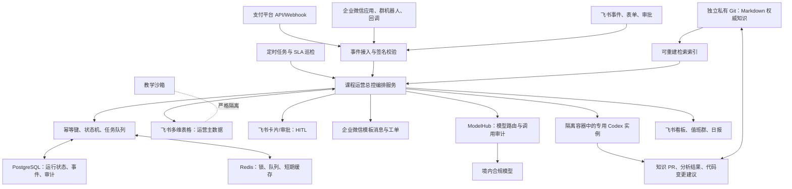
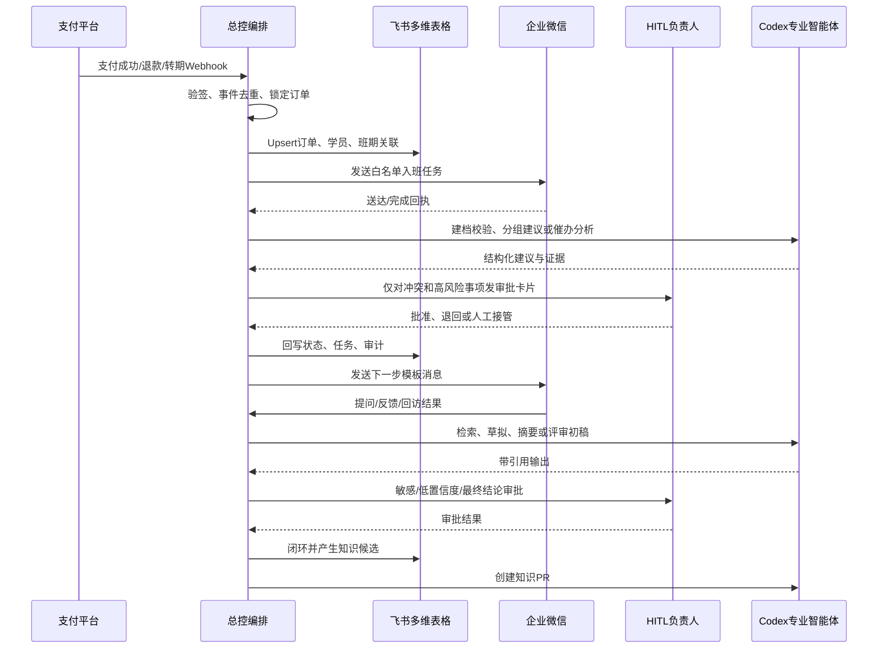
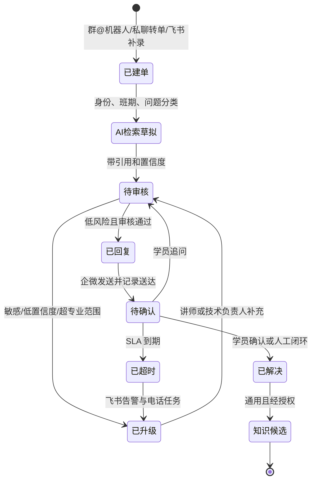
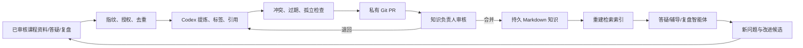

# 课程运营智能体系统落地行动计划

> 版本：`v1.0-20260813-002416`  
> 生成时间：2026-08-13 00:24:16（Asia/Shanghai）  
> 课程日期：2026-08-20 至 2026-08-21  
> 依据：[2 天 AI 原生业务实战课运营行动计划 v2.0](two-day-ai-native-course-operations-action-plan-v2.0-20260812-232616.md)、[AI 课程会务筹备工作共创讨论](AI课程会务筹备工作共创讨论@20260812.md)  
> 参考：[ModelHub 入门概览](https://modelhub.wuhancloud.cn/docs/getting-started/overview)、[lucasastorian/llmwiki](https://github.com/lucasastorian/llmwiki)

## 1. 执行摘要

### 1.1 目标

建设一套以飞书多维表格为运营主数据中心、企业微信为学员触达入口、ModelHub 为模型统一入口、专用 Codex 实例为可按需调用的智能执行单元的课程运营智能体系统。系统覆盖报名、支付、建档、课前准备、分组、签到、授课、答疑、成果评审、30 天辅导、7/30/90 天回访、销售交接、复盘和知识沉淀。

目标不是“让 AI 代替所有人”，而是让确定性、重复性、可审计的工作自动运行；把退款/转期、分组最终确认、敏感答疑、成果终评、销售交接、知识发布等关键责任保留给人。

### 1.2 已确认基线

| 维度 | 决策 |
| --- | --- |
| 首期范围 | 2026-08-20 开课前上线 P0 核心闭环；课中、课后增量启用 |
| 课程 | 2 天线下收费课，25–30 人，5–6 个小组，2 天授课 + 30 天服务 |
| 主数据 | 飞书多维表格从零建立，课程运营状态唯一以飞书为准 |
| 财务事实源 | 支付平台 API/Webhook；订单、退款、转期、发票状态由支付平台确认 |
| 触达 | 企业微信自建应用、客户联系 API、群机器人和回调地址；企业微信负责学员触达 |
| 模型 | 境内合规模型；敏感字段调用前脱敏；统一经 ModelHub 路由，业务智能体不持有模型密钥 |
| 编排 | 事件驱动 + 定时巡检 + 人工指令；TypeScript + Node.js 常驻服务 |
| Codex | 隔离容器中非交互运行；按任务临时启动专用实例，最小权限、超时、回收 |
| 知识权威源 | 独立私有 Git 仓库中的 Markdown；AI 提交 PR，知识负责人审核合并 |
| HITL | 分级审批；正常流程自动化，异常、高风险和关键决策人工确认 |
| 告警 | 飞书值班群卡片为主；超时后生成电话任务，由值班人员人工拨打 |
| 演示隔离 | 生产只读脱敏镜像 + 独立教学沙箱，课堂操作不能写生产 |
| 交付方式 | 本轮仅输出设计和实施计划，不执行飞书、企业微信、支付或云端生产写操作 |

### 1.3 关键判断与约束

1. **时间约束是最高风险**：距课程开课只有 7 天，必须先上线稳定、确定性的 P0 链路，再放量 AI 答疑、评审和知识维护。
2. **从零建模不能等同于从零手工录入**：先冻结对象、主键、状态和事件，再用支付 Webhook、表单和批量导入初始化数据。
3. **Codex 不是常驻消息队列**：它由常驻编排服务按任务唤起；队列、幂等、重试、告警和状态持久化由 Node.js 服务负责。
4. **LLMWiki 只能作为设计参考**：吸收“原始来源不变、Wiki 为持久知识、索引可重建、MCP 工具化维护”的思想，不把第三方实现作为不可替换的生产依赖。
5. **学员体验优先于自动化率**：自动化误发、错配、泄露或阻断人工接管时，立即暂停相关规则并转人工。

## 2. 目标架构



### 2.1 组件责任边界

| 组件 | 负责 | 不负责 |
| --- | --- | --- |
| Node.js 总控 | 接收事件、编排、状态机、幂等、重试、超时、工具授权和回写 | 自行维护支付事实、直接持有模型供应商密钥 |
| PostgreSQL | 事件收据、任务、锁、执行记录、审计、版本关联 | 替代飞书运营主数据 |
| Redis | 分布式锁、短队列、短期缓存、限流 | 作为不可恢复的唯一事实源 |
| 飞书多维表格 | 学员、班期、订单映射、任务、答疑、签到、成果、回访、审批状态 | 保存模型密钥或未授权原始录音 |
| 企业微信 | 学员触达、群/私聊答疑入口、送达回执 | 作为跨系统永久身份主键 |
| ModelHub | 统一模型调用、路由、配额/日志能力（以实际文档和账号能力为准） | 直接决定业务状态或审批结果 |
| 专用 Codex | 分析、草拟、代码/知识 PR、复盘摘要 | 直接合并知识、直接发敏感消息、直接改生产权限 |
| Git 知识库 | 版本化 Markdown、引用、审查、回滚 | 作为飞书运营交易数据存储 |

## 3. 智能体编制

采用“总控编排智能体 + 专业领域智能体”。专业智能体不是必须常驻的独立进程，而是由总控以角色、工具白名单、输入快照和输出契约启动的 Codex 任务。

| 智能体 | 触发 | 自动动作 | 必须 HITL |
| --- | --- | --- | --- |
| 总控编排 | 任一业务事件、定时巡检、人工指令 | 路由、状态推进、重试、超时升级、暂停/恢复 | 改变全局状态、人工接管 |
| 招生建档 | 支付成功/退款/转期 Webhook | 建立 `student_id`、订单映射、入班任务、重复检查 | 冲突身份、未支付入班、退款例外 |
| 课前运营 | 入班确认、每日定时 | 生成问卷/流程卡/环境验证/行程任务，发送白名单模板 | 自由文本、批量策略变更、特殊需求 |
| 分组排班 | 资料齐全、T-2 定时 | 按业务环节、基础和助教容量生成分组建议 | 分组最终确认、特殊关系隔离 |
| 会务指挥 | 签到、迟到、异常、现场指令 | 生成签到状态、补救任务、值班卡片、看板更新 | 未付款放行、临时替补、课程暂停 |
| 答疑分派 | 企微 `@机器人`、私聊转单、飞书补录 | 建单、分类、检索、草拟引用、SLA 计时、升级 | 敏感/低置信度答案、讲师口径、对外发送 |
| 学习体验 | 微反馈、缺勤、未交付、负面信号 | 生成证据摘要和干预建议 | 是否干预、是否中止服务 |
| 成果评审 | 成果提交/版本更新 | 按量表初评、指出证据缺口、生成反馈草稿 | 最终等级、结业结论、公开展示 |
| 回访服务 | 结课后 7/30/90 天、30 天服务任务 | 发送模板、收集结构化结果、生成摘要和待办 | 主动销售、企业报告、客诉处置 |
| 复盘分析 | 每日复盘、结课后、30 天结束 | 统计闭环率、SLA、自动化率、根因和改进任务 | 改变课程标准、预算和服务承诺 |
| 知识维护 | 新资料、已审核答疑、复盘结论 | 摄取、去重、引用、冲突检查、创建 PR、索引构建 | PR 合并、知识发布/废弃 |
| 审计异常 | 重复事件、权限错误、模型失败、数据越界 | 冻结任务、创建告警、生成补偿建议 | 恢复生产、扩大重试范围 |

### 3.1 Codex 任务契约

每次启动专用实例必须包含：

- `task_id`、`agent_role`、`course_id`、`cohort_id`、输入快照版本。
- 允许读取的表/字段、允许调用的工具和允许写入的目标。
- 脱敏后的上下文；禁止注入密钥、原始手机号、身份证、支付凭据和未授权原文。
- 结构化输出 Schema、置信度、引用 ID、建议动作和需要人工确认的原因。
- 超时时间、最大重试次数、预算上限、失败回调和工作区回收策略。

### 3.2 人员组织与生产责任

首期人员按已确认规模组织：课程负责人 1 名、会务/教务 2 名、讲师 1–2 名、助教 5–6 名、客服 1 名、销售 1 名；技术侧为技术负责人 1 名、开发/自动化工程师 2–3 名。岗位可兼任，但审批人与执行人要在高风险操作上分离。

| 责任域 | A 最终负责 | R 执行 | C 协作 | 生产值班重点 |
| --- | --- | --- | --- | --- |
| 全局流程与放行 | 课程负责人/总值班 | 教务、技术负责人 | 讲师、会务 | 暂停、人工接管、Go/No-Go |
| 支付与入班 | 财务/课程负责人 | 开发、学员运营 | 教务 | 对账、退款、转期、身份冲突 |
| 飞书数据与编排 | 技术负责人 | 2–3 名开发/自动化工程师 | 教务 | Webhook、队列、Base、审计、恢复 |
| 企微触达与服务 | 学员运营负责人 | 客服、助教 | 技术负责人 | 送达、退订、答疑 SLA、客诉 |
| 教学与成果 | 主讲 | 5–6 名带组助教 | 课程负责人 | 内容口径、终评、掉队干预 |
| 会务与签到 | 会务负责人 | 2 名会务/教务 | 技术负责人 | 准入、补救台、场地安全 |
| 知识与模型 | 知识负责人/主讲 | 知识智能体、技术人员 | 助教 | PR 审核、引用、模型异常 |
| 回访与销售 | 课程负责人 | 客服、销售 | 助教、企业对接 | 服务优先、授权、销售交接 |

生产期间设一个飞书值班群和一个总值班负责人。每个领域配置主审批人、替补审批人、手机号和响应时限；群内讨论不能替代任务认领和审批记录。

## 4. 端到端业务闭环



### 4.1 P0 开课前必须生产化

1. 支付 API/Webhook 验签、事件去重、订单/退款/转期同步和异常对账。
2. 学员建档、内部 `student_id`、班期关联、重复身份人工确认。
3. 入群、问卷、业务流程卡、脱敏样例、设备/环境验证和催办任务。
4. 分组建议、助教容量校验、人工确认和变更记录。
5. T-7 至 T-1 白名单模板触达、状态差异化催办、未回复电话任务。
6. 唯一签到码核销、迟到/缺席、补救台、看板和人工放行审计。
7. 飞书值班群告警、P0/P1 超时电话任务、暂停开关、人工补偿。
8. 生产/开发/教学沙箱隔离，以及脱敏只读演示镜像。

### 4.2 课中增量启用

- 企微群机器人、私聊转单和飞书内部补录统一建立答疑工单。
- 技术阻塞 5 分钟响应，普通问题 30 分钟响应，复杂问题当日闭环或明确负责人及时间。
- AI 仅生成带引用答案草稿；讲师/助教审核后回复。
- 现场微反馈、掉队预警、助教资源调整和成果验收记录进入飞书。

### 4.3 课后增量启用

- 30 天企业微信服务，每日 09:00–21:00，4 小时首次响应，复杂问题 24 小时给出方案。
- 每周 1 次、每次 90 分钟，共 4 次线上辅导；自动排期、提醒、报名和纪要。
- AI 成果初评、人工终评；结业标准为 2 天累计出勤不低于 80% 且成果达到“基础”及以上。
- 30 天服务结束后执行 7/30/90 天回访；营销和企业报告单独授权。

## 5. 飞书多维表格数据模型

### 5.1 主键与事实源

- 永久学员主键：系统生成 `student_id`，不可使用手机号作为永久主键。
- 班期主键：`cohort_id`；课程模板主键：`course_id`；事件主键：`event_id`；任务主键：`task_id`。
- 手机号加密保存，仅用于初始匹配和必要触达；企微外部联系人 ID、支付订单号均为外部关联键。
- 支付、退款、转期、发票以支付平台为事实源；运营状态以飞书多维表格为事实源；所有外部状态变更保留原始事件。

### 5.2 核心表

| 表 | 必备字段 | 关键状态/约束 |
| --- | --- | --- |
| 课程模板 | `course_id`、版本、目标、议程、成果标准、消息模板 | 发布版本不可覆盖 |
| 班期 | `cohort_id`、日期、容量、地点、服务承诺、当前版本 | `draft/ready/live/closed` |
| 学员 | `student_id`、脱敏身份、手机号密文、企微绑定、授权、历史班期 | 个人信息最小权限 |
| 企业 | `org_id`、企业名、联系人、报告授权 | 企业空间隔离 |
| 订单 | `order_id`、支付平台、金额、支付状态、退款/转期/发票、Webhook 版本 | 外部订单唯一 |
| 报名入班 | `student_id`、`cohort_id`、报名状态、入班状态、分组、负责人 | 仅已支付且未退款可入班 |
| 任务 | `task_id`、类型、触发事件、负责人、截止、状态、重试次数 | 幂等键唯一 |
| 触达记录 | 模板、变量版本、渠道、送达、失败、退订 | 白名单模板才可自动发 |
| 分组排班 | 小组、助教、容量、建议依据、确认人 | 最终确认人工 |
| 签到出勤 | 签到码、核销时间、迟到/早退、放行人、原始值 | 每日独立签到 |
| 答疑工单 | 问题、分类、置信度、引用、负责人、SLA、回复、满意度 | 敏感问题强制审批 |
| 微反馈预警 | 评分、证据、风险级别、干预任务、恢复结果 | AI 不直接处置 |
| 成果与评审 | 版本、提交物、量表初评、终评、评语、授权 | 终评人工 |
| 辅导回访 | 场次、出席、问题、应用、效果、下次行动 | 7/30/90 天节点 |
| 销售交接 | 授权、线索原因、负责人、阶段、下次行动 | 无营销授权不得创建主动跟进 |
| 智能体任务 | `task_id`、角色、输入快照、工具、输出、置信度、费用、结果 | 可重放、可审计 |
| 事件收据 | `event_id`、来源、签名、接收时间、处理状态、重放次数 | 永久去重依据 |
| 审计日志 | 操作人/智能体、对象、前后值摘要、原因、审批、时间 | 敏感字段不记录明文 |

### 5.3 从零建表顺序

1. `课程模板`、`班期`、`学员`、`订单`、`报名入班`、`事件收据`、`审计日志`。
2. `任务`、`触达记录`、`分组排班`、`签到出勤`、`智能体任务`。
3. `答疑工单`、`微反馈预警`、`成果与评审`、`辅导回访`、`销售交接`。
4. 看板和视图：待处理异常、未完成课前任务、支付对账、签到现场、SLA、成果、回访。

### 5.4 八类业务角色与数据权限

权限同时受“角色 + 班期 + 服务小组 + 企业空间 + 字段敏感级别”约束。

| 角色 | 可访问范围 | 禁止或需审批 |
| --- | --- | --- |
| 管理员 | 系统配置、账号、权限、审计 | 不因管理员身份默认查看全部敏感原文 |
| 课程运营 | 授权课程/班期的任务、名单、通知和报表 | 支付凭据、未授权私密答疑 |
| 招生顾问 | 已授权且已分派的销售线索 | 学习困惑原文、企业私有资料、未授权学员 |
| 班主任/学员运营 | 负责班期、服务小组、风险和回访 | 跨班期敏感数据、匿名反馈身份反推 |
| 讲师 | 授权班期的教学内容、专业答疑、成果终评 | 财务明细、营销数据 |
| 助教 | 负责小组的答疑、学习进度、成果初审 | 其他小组私密问题、最终结业决定 |
| 学员 | 本人档案、任务、答疑、成果、反馈 | 他人数据、生产配置、真实运营写权限 |
| 企业观察员 | 经成员授权的本企业汇总进度和成果 | 私人问答、匿名反馈原文、销售意向和其他企业数据 |

专用 Codex 实例不作为第九类业务角色；它使用服务账号和短时工具令牌，权限映射到发起任务的领域，并被额外限制为最小字段集。

## 6. HITL 决策矩阵

| 决策 | AI 可做 | 人工必须做 | 审批角色 |
| --- | --- | --- | --- |
| 支付建档 | 验签、匹配、Upsert | 冲突、重复、退款例外 | 财务/学员运营 |
| 入班 | 生成建议、发送任务 | 未支付放行、转期、退班 | 教务/财务 |
| 分组 | 生成候选分组和解释 | 最终确认、特殊隔离 | 课程负责人 |
| 对外消息 | 白名单模板填变量 | 自由文本、群发策略、敏感内容 | 学员运营/总值班 |
| 答疑 | 检索、分类、草拟、引用 | 敏感、低置信度、专业口径、发送 | 助教/讲师 |
| 成果 | 初评和反馈建议 | 最终等级、结业、公开展示 | 讲师 |
| 回访 | 模板、摘要、待办 | 客诉、企业报告、主动销售 | 班主任/企业对接 |
| 知识 | 创建分支、引用、PR、索引 | 合并、发布、废弃、冲突裁决 | 知识负责人 |
| 事故 | 识别、冻结、告警、补偿建议 | 恢复生产、扩大重试、暂停课程 | 总值班/技术负责人 |

## 7. 企业微信与答疑闭环



企业微信只处理明确 `@机器人`、私聊入口或工作人员主动转单的内容，不默认监听全部群聊。企微外部联系人 ID 只作关联字段，统一映射到内部 `student_id`。

## 8. ModelHub 与数据安全

ModelHub 作为统一模型网关，当前方案只依赖其已确认的接入能力；具体 API 路径、模型名称、配额、路由策略和日志字段必须在实施时以账号权限及官方文档为准，不在业务代码中写死。

### 8.1 调用链

1. 编排服务按任务等级选择“境内合规模型策略”。
2. 脱敏服务移除手机号、身份证、支付凭据、企业机密和未授权原文。
3. 通过 ModelHub 调用，附带 `task_id`、模型策略、超时和预算标签。
4. 校验结构化输出、引用 ID、置信度和敏感词；失败则重试或转人工。
5. 记录调用摘要、耗时、token/费用（如接口提供）、错误类型和模型版本，不保存不必要的原始上下文。

### 8.2 数据分级

| 级别 | 示例 | 模型处理 |
| --- | --- | --- |
| L0 | 课程大纲、公开模板 | 可直接检索/生成 |
| L1 | 脱敏学习记录、匿名问题 | 境内模型，限定用途 |
| L2 | 姓名、手机号、企业关联 | 默认不进模型；确需使用先脱敏 |
| L3 | 支付凭据、身份证、合同、健康信息、未授权录音 | 禁止进入模型上下文 |

授权需分别覆盖课程运营、录音转写、AI 分析、案例展示和营销触达；默认不用于公开案例或模型训练，撤回后停止后续处理并按留存策略匿名化/删除。

## 9. LLMWiki 风格可进化知识库

### 9.1 生产落地取舍

参考 Karpathy LLM Wiki 理念及 `lucasastorian/llmwiki`：来源文件保持原样；生成知识是持久 Markdown；搜索索引是可重建派生层；智能体通过受控工具创建、编辑、关联、引用和维护知识。生产上采用以下分工：

- **独立私有 Git 仓库**：唯一权威源，保存 `sources/`、`wiki/`、`schemas/`、`reviews/` 和版本元数据。
- **飞书 Wiki/文档**：面向团队阅读、提交需求、查看 PR/发布状态和 HITL 审批，不反向覆盖 Git。
- **Codex 知识智能体**：摄取已审核课程资料、答疑和复盘候选，生成带引用 PR，发现冲突、孤立页和过期页。
- **索引服务**：由 Git 内容构建，可删除并重建；索引损坏不影响知识源。

### 9.2 目录建议

```text
course-knowledge-private/
  sources/                 # 原始资料副本与来源元数据，不覆盖原文件
  wiki/                    # 可读、可引用、可回滚的持久知识
    course/
    operations/
    faq/
    incidents/
    retrospectives/
  schemas/                 # 术语、标签、引用和 frontmatter 约束
  reviews/                 # PR、审批和发布记录
  .index/                  # 可删除、可重建的派生索引
```

首期只摄取已审核课程大纲、课件、讲师讲稿、操作手册、标准 FAQ、作业标准和会务 SOP；历史群聊、个人文件和未授权资料进入待审清单，不直接进入生产检索。

### 9.3 知识演进闭环



每个知识页必须有来源、发布日期、适用班期/版本、责任人、审核状态和失效条件。知识智能体只能创建分支和 PR，不能直接合并主分支。

## 10. 可靠性、幂等与异常补偿

### 10.1 事件处理

- Webhook 先验签，再写入 `事件收据`，以 `source + event_id` 去重。
- 事件处理采用 `received -> processing -> succeeded/failed/dead_letter` 状态；业务写入和任务创建使用事务或可恢复 outbox。
- 外部 API 超时采用指数退避，最多 3 次；非幂等操作必须先取得业务幂等锁。
- 失败事件进入死信队列，飞书值班群发送卡片，超时后生成电话任务。
- 每个任务支持人工“重试、跳过、暂停、补录、回滚建议”，所有操作写审计。

### 10.2 必测异常

1. 支付成功重复 Webhook、乱序 Webhook、退款晚于入班。
2. 企微送达失败、外部联系人未绑定、退订后再次触达。
3. 飞书写入超时、字段校验失败、权限失效。
4. ModelHub 超时、配额不足、模型不可用、输出格式错误。
5. Codex 超时、工作区未回收、PR 冲突、工具越权。
6. 签到重复核销、未支付学员、临时替补、网络中断。
7. 答疑超时、敏感内容、学员追问、知识引用失效。

## 11. 7 天实施计划与放行门槛

### 11.1 2026-08-13：冻结设计与建库

- 技术负责人冻结服务边界、环境、密钥托管、事件命名和 `student_id` 规则。
- 数据工程师按第 5 节顺序创建飞书 Base 设计稿和字段字典；先在测试空间验证。
- 支付工程师拿到 API/Webhook 文档，完成验签、事件样例和退款/转期状态映射。
- 企微工程师核验客户联系 API、机器人、回调和模板消息权限。
- 知识负责人创建独立私有 Git 仓库和首批核心资料清单。

**验收**：状态机和主键评审通过；未确认的外部能力形成阻塞清单；不写生产数据。

### 11.2 2026-08-14：P0 编排与支付建档

- 实现 Node.js Webhook 接收、签名、事件收据、队列、重试、审计和飞书 Upsert。
- 建立订单、学员、报名入班、任务和触达表；导入一笔测试订单。
- 配置白名单消息模板、企微回执和失败任务。
- 启动 ModelHub 连通、脱敏、超时和降级测试。

**验收**：同一支付事件重放不重复建档或发消息；退款/转期不会错误入班。

### 11.3 2026-08-15：课前任务、分组、告警

- 上线问卷、流程卡、环境验证、入群、T-7 催办任务。
- Codex 分组智能体只输出建议和依据；飞书卡片供课程负责人确认。
- 建立异常视图、值班群卡片、认领/升级/电话任务。

**验收**：一个测试学员从支付到课前任务完整流转；所有消息可追踪送达和退订。

### 11.4 2026-08-16：签到、看板与人工接管

- 实现签到码核销、迟到/缺席、补救台、看板和异常放行记录。
- 完成生产、教学沙箱、脱敏只读镜像隔离。
- 运营人员演练暂停自动化、人工补录和恢复。

**验收**：网络中断、重复签到、未付款和临时替补均能人工闭环。

### 11.5 2026-08-17：联调与 Codex 影子运行

- 跑通企微答疑建单、ModelHub 检索草稿、引用检查和人工审核，不自动对外发送。
- 专用 Codex 完成一次分组、一次异常分析、一次知识 PR 演练。
- 讲师、助教和运营参加 90 分钟按角色演练。

**验收**：P0 链路全链路测试通过；答疑与知识智能体只影子运行。

### 11.6 2026-08-18：名单冻结与全链路演练

- 支付/退款/转期最终对账；名单、分组、助教和权限冻结。
- 通过正常、重复、失败、超时、人工接管五类场景演练。
- 修复 P0；P1 在 8 月 19 日中午前关闭。

### 11.7 2026-08-19：进场联调与 Go/No-Go

- 实测网络、投屏、音响、签到、二维码、企微、值班群和备用资料。
- T-1 完成企微确认；未回复者生成电话任务并回填。
- 19:00 后只允许 P0 修复；总负责人签署放行。

### 11.8 Go/No-Go 标准

全部满足才放行：

- P0 缺陷为 0，P1 有明确负责人、截止时间和人工兜底。
- 支付事件闭环率 100%，重复事件不产生重复业务动作。
- 100% 正式学员可追溯到 `student_id`、班期、支付状态和触达状态。
- 关键白名单流程自动执行率目标 `>= 80%`，人工仅处理审批和异常。
- 签到、任务、告警、暂停、重试、补录、审计均完成演练。
- 技术阻塞 5 分钟、普通问题 30 分钟响应链路已分配负责人。
- 生产、教学沙箱、模型密钥和知识仓库权限隔离通过。

## 12. 指标、运维和复盘

### 12.1 首期指标

| 类别 | 指标 |
| --- | --- |
| 闭环 | P0 事件闭环率 100%；可重放事件 100% 可追踪 |
| 自动化 | 白名单流程自动执行率 >= 80%；重复触达率 0 |
| 体验 | 满意度 >= 4.7/5；NPS >= 50 |
| 学习 | 现场成果完成率 >= 80%；出勤达标率；成果通过率 |
| 响应 | 技术阻塞 5 分钟响应率；普通问题 30 分钟响应率；课后 4 小时首次响应率 |
| 可靠性 | Webhook 成功率、死信数、恢复时间、人工接管率、模型失败率 |
| 知识 | PR 通过率、引用有效率、孤立页/过期页数、知识命中后解决率 |

### 12.2 值班与复盘

- 总值班负责人拥有暂停流程、切换人工和事故升级权；领域审批人负责本领域决策。
- 飞书值班群每条告警包含事件、影响、负责人、按钮、截止时间和电话任务状态。
- 课程每日课后复盘；结课后 24 小时发送资料和未解决问题计划，48 小时完成初步复盘，7 天完成正式复盘，30 天服务结束完成总复盘。
- 复盘结论必须转为有负责人、期限、验收标准的 Git/飞书改进任务，不以“加强沟通”作为无责任人的结论。

## 13. `lark-cli` 实施映射

本节只给出实施命令映射，不执行真实写操作。所有写入应先在测试空间、使用 `--as bot` 或经过明确授权的身份、先读当前结构，再执行最小变更。

| 目标 | CLI 路径 | 说明 |
| --- | --- | --- |
| 创建 Base/表/字段 | `lark-cli base +base-create`、`+table-create`、`+field-create` | 先读取字段 JSON 规范；名称和 ID 以返回为准 |
| 记录 Upsert | `lark-cli base +record-upsert`、`+record-batch-create` | 以业务幂等键控制，不盲目批量写入 |
| 视图/看板 | `+view-create`、`+dashboard-create`、`+dashboard-block-create` | 先读结构，生产看板最后启用 |
| 工作流 | `+workflow-create`、`+workflow-enable` | 复杂 steps 先按 schema 验证；先禁用测试 |
| 审批/消息 | 对应飞书审批、消息技能或业务服务 | 高风险动作必须保留审批卡片 |
| 事件消费 | `lark-cli event list/schema/consume` | 先查 EventKey schema；生产消费者由 Node.js 托管 |
| 机器人命令 | `lark-cli application +slash-command-create` | 使用幂等重跑；命令只触发受控任务 |

建议先执行只读盘点：`lark-cli auth status`、`lark-cli base --help`、`lark-cli event list --json`。当前已知机器人身份可用、用户身份尚未登录；不应在文档或日志中暴露应用 ID、密钥或完整回调地址。

## 14. 安全、回滚与剩余风险

### 14.1 必须保留的护栏

- 所有密钥进入云密钥管理，不进入 Git、Codex 上下文、飞书字段或日志。
- 生产、开发、教学沙箱使用不同账号、Base、知识仓库和企微触达配置。
- 对外消息只能使用白名单模板；变量来自已校验字段。
- 任何 AI 输出都带任务 ID、版本、引用和置信度；不允许无引用的专业结论直接发送。
- 支付、退款、转期、结业、销售和知识发布均可人工暂停和回滚。

### 14.2 剩余风险

1. ModelHub 官网可访问，但具体模型、配额、日志和错误码需用当前账号再验证；在验证前不把具体能力写死。
2. 企业微信客户联系/会话回调的实际字段和合规存档范围需联调；不以“机器人在线”推断所有接口可用。
3. 支付 Webhook 的签名和退款/转期事件顺序必须以支付供应商文档为准。
4. 飞书从零建模与权限配置在 7 天内较紧，必须先测试空间演练，无法完成时保留人工/CSV 兜底。
5. 自动电话能力未接入；P0/P1 超时只能生成由值班人员人工拨打的电话任务。
6. 知识资料分散且首期仅纳入审核核心资料，答疑覆盖面有限；不得将未审群聊内容直接加入索引。

## 15. 自审结论

- 已把 v2.0 的 2 天授课、30 天辅导、5–6 个小组、助教编制、签到准入、答疑 SLA、结业标准、7/30/90 天回访和生产/教学隔离纳入系统方案。
- 已将本轮新决策落实：支付 API/Webhook、飞书从零建模、ModelHub 统一配置、境内模型与脱敏、Git 唯一知识源、PR 审核、Codex 隔离实例、TypeScript/Node.js、飞书值班群+人工电话、P0 先行。
- 已区分自动执行与 HITL，避免“AI 自动决定退款、结业、销售或知识发布”的逻辑漏洞。
- Mermaid 图均使用简洁中文节点和标准 `flowchart`/`sequenceDiagram`/`stateDiagram-v2` 语法，并已用 `mmdc` 对每个代码块逐一渲染通过。
- 本文是规划文档，不代表飞书、企业微信、支付平台、ModelHub 或云环境已经完成配置；实际写入须按第 13 节先测试、再授权、后生产放行。
