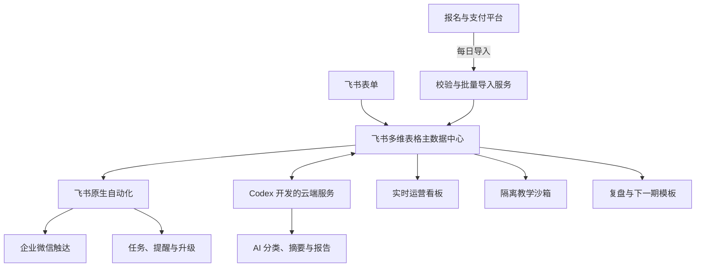
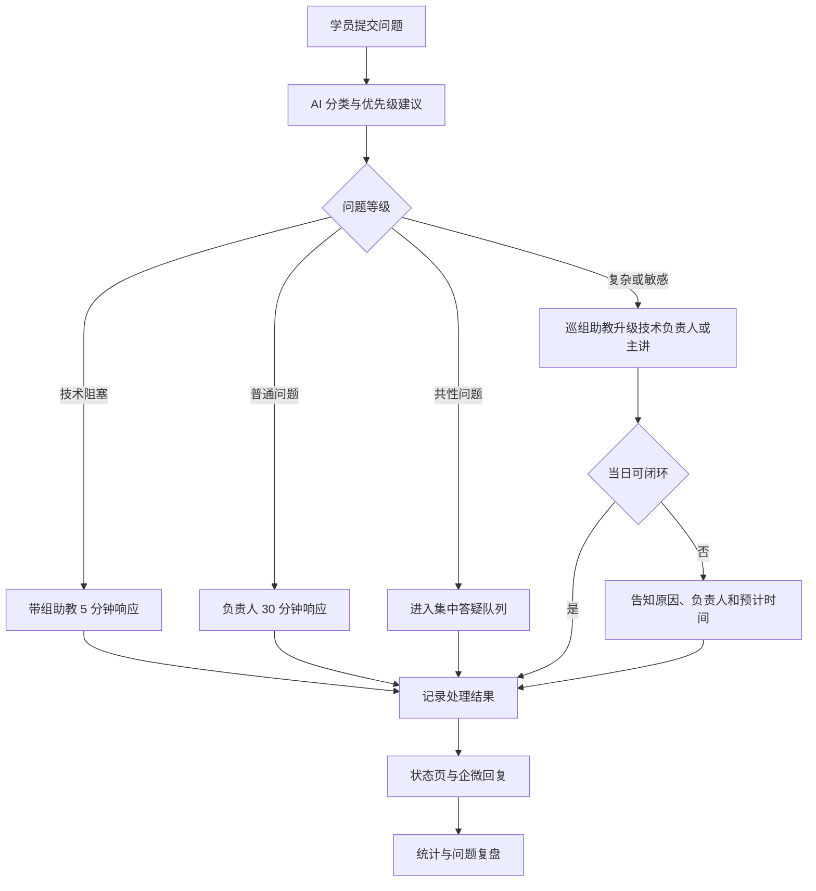

# 2 天 AI 原生业务实战课运营行动计划（v2.0）

> 版本：`v2.0-20260812-232616`  
> 生成时间：2026-08-12 23:26:16（Asia/Shanghai）  
> 历史基线：[two-day-ai-native-course-operations-action-plan.md](two-day-ai-native-course-operations-action-plan.md)  
> 优化依据：[AI课程会务筹备工作共创讨论@20260812.md](AI课程会务筹备工作共创讨论@20260812.md)

本版本保留 v1 原有的学习旅程、数据模型、自动化、教学沙箱、风险治理和 30 天辅导框架，新增或强化场内主持与场外会务总监分工、带组/巡组助教、唯一执行手册、T-7 预热、T-1 到场确认、签到手环准入、财务归口、标准物料、影像运营和长期收费课社群机制。

## 1. 执行摘要

### 1.1 课程定位

本次课程不是传统的软件教学课，而是一次真实收费课程运营与教学融合的生产实践：举办方以自身筹备、交付、复盘和持续运营这门课程的全过程为案例，展示 AI 原生教育团队如何用统一数据、自动化和智能体降低人工跟进成本，并帮助学员将同一方法迁移到自己的业务。

| 项目 | 已确认安排 |
| --- | --- |
| 课程日期 | 2026 年 8 月 20–21 日 |
| 上课时间 | 每日 09:00–17:00，08:30 开始签到 |
| 课程形式 | 全程线下，小班实战 |
| 预计人数 | 25–30 人 |
| 学员构成 | 企业管理者与职场业务人员，跨行业 |
| 学员基础 | 多数有 AI 日常使用经验，非专业开发者为主 |
| 教学比例 | 30% 讲授、70% 实操 |
| 学习成果 | 每人完成一份 AI 原生业务流程蓝图和一个可运行的核心自动化 |
| 工具底座 | 飞书全家桶 + 飞书原生自动化 + Codex 按需开发 + 企业微信触达 |
| 主数据中心 | 飞书多维表格 |
| 自定义服务 | 部署于已有云服务器或 Serverless 环境 |
| 现场分组 | 5–6 个岛式小组，每组 4–6 人，每组固定 1 名带组技术助教，另设 1 名巡组助教 |
| 课后服务 | 30 天企微群答疑 + 每周 1 次、每次 90 分钟线上辅导，共 4 次 |
| 首要指标 | 满意度不低于 4.7/5，NPS 不低于 50 |
| 质量护栏 | 个人成果现场完成率不低于 80%；30 天实际使用率首期建立基线 |
| 证书 | 不提供；以成果验收和书面反馈证明学习结果 |

### 1.2 核心判断

1. **本次交付有双重目标**：一是确保真实收费课程稳定运行，二是把运行过程变成可观察、可迁移的教学案例。发生冲突时，学员体验和真实交付优先。
2. **最大风险是并行交付压力**：只有 3–4 个有效筹备日，却要完成课程材料、飞书数据模型、核心自动化、教学沙箱和现场会务。必须采用“全模型先设计、核心链路先上线、其余分阶段启用”。
3. **自动化不等于无人负责**：正常流程自动执行；支付异常、隐私授权、敏感数据、投诉、低置信度 AI 输出和系统故障自动转人工。
4. **真实运营与教学实验必须隔离**：生产系统使用冻结稳定版；课堂只在教学沙箱增量搭建。现场开发失败不得影响真实课程运营。
5. **跨行业学员不按行业分组**：使用“获客、成交、交付、服务、复购、内部管理”通用链路，按学员希望改造的业务环节分组。

### 1.3 执行优先级

| 级别 | 必须达成 | 处理原则 |
| --- | --- | --- |
| P0 交付底线 | 收费名单准确、通知送达、账号可用、场地安全、课程可讲、标准案例可运行、签到准入与现场支持可用 | 任一项未通过即升级总负责人，不得带病开课 |
| P1 核心体验 | 学员课前有准备、T-1 到场确认完成、现场不掉队、问题及时响应、个人成果可验收、反馈可实时纠偏 | 资源优先保障，非必要展示为其让路 |
| P2 AI 原生示范 | 主数据中心、自动任务流、实时看板、问题智能分派、自动复盘 | 必须有稳定版和人工兜底 |
| P3 增强体验 | 照片直播、AI 混剪、合影手持牌、更多案例、复杂集成和课间品牌内容 | 只在 P0–P2 全部稳定后执行 |

## 2. 完美学习旅程

### 2.1 旅程体验标准

- 学员在每个阶段都知道“现在做什么、为什么做、何时完成、在哪里获得帮助”。
- 同一信息只采集一次，后续流程从主数据中心读取，不反复询问学员。
- 正常流程由自动化推进；需要人工时，学员能看到负责人和预计处理时间。
- 技术阻塞不超过 5 分钟无人响应，普通问题不超过 30 分钟无人响应。
- 每次反馈都产生动作：即时修正、个人干预或课后改进，不做只收集不处理的问卷。
- 学员带走的不只是代码，而是可解释的业务蓝图、可运行自动化、迁移方法和 30 天迭代路径。

## 3. 团队组织与指挥机制

### 3.1 推荐编制

| 岗位 | 人数 | 核心责任 |
| --- | ---: | --- |
| 总负责人/现场总指挥 | 1 | 范围、优先级、跨组决策、预算和重大异常最终负责 |
| 课程产品负责人 | 1 | 学习目标、议程、材料、成果标准和内容版本负责 |
| 主讲 | 1 | 授课、示范、共性问题解答、成果质量把关 |
| 场内主持人 | 1 | 调节课堂能量、控制转场、提醒讲师休息、发布茶歇和集中答疑安排 |
| 技术负责人 | 1 | 生产系统、教学沙箱、云环境、部署、日志和技术应急 |
| 带组技术助教 | 5–6 | 每组固定 1 人，两天持续负责同组学员、排障、进度观察、验收和记录 |
| 巡组技术助教 | 1 | 支援带组助教处理跨组或高难度问题，统一汇总共性问题并向主讲升级 |
| 学员运营负责人 | 1 | 名单、入群、课前任务、通知、反馈、回访和学员体验 |
| 数据与自动化负责人 | 1 | 飞书数据模型、导入、自动化、看板、数据质量和复盘报表 |
| 会务总监 | 1 | 统筹场外场地、餐饮、物料、签到、动线、供应商和现场秩序，不干预场内教学节奏 |
| 现场安全负责人 | 1 | 特殊需求、急救、疏散、事件处置和场地方联络 |
| 财务与采购归口 | 1 | 预算台账、采购审批、凭证收集、即时结算和课后汇总 |
| 影像小组 | 1–2 | 按授权拍摄、素材归口、筛选美化、照片直播和宣传版本制作 |
| 企业客户对接 | 1 | 企业名单、授权、汇总报告和企业需求管理 |

岗位可兼任，但以下职责不得由同一人在课堂高峰期同时承担：主讲与现场总指挥、技术助教与会务、数据自动化与摄影、安全负责人和主讲。

根据 2026-08-12 共创会议已确认的岗位落位：**郝老师担任场内主持人，小刘担任会务总监，小凡负责技术板块**。总负责人需在执行手册中补齐主讲、带组助教、巡组助教、学员运营、数据自动化、财务、安全和影像岗位的姓名、手机、替补和当日到岗时间。

### 3.2 指挥规则

- 只有总负责人可以改变当日议程、暂停课程或启动重大应急方案。
- 每项任务只有一名最终负责人，群内多人讨论不能替代明确指派。
- 现场问题先进入飞书问题表，再按“带组助教 → 巡组助教 → 技术负责人/主讲 → 总负责人”升级。
- 主讲授课期间，助教不得在组内另开一套小课；非技术阻塞问题先记录，在休息或集中答疑窗口统一处理。
- 场内主持人只负责场内节奏，会务总监只负责场外执行；跨边界事项由总负责人裁决。
- 每日开课前举行 15 分钟站会；午间举行 10 分钟体验检查；结课后举行 30 分钟当日复盘。
- 所有临时决策在飞书记录决策人、原因、影响和后续动作，禁止只在口头或私聊中留存。

### 3.3 RACI 责任矩阵

说明：`A` 最终负责，`R` 执行，`C` 协作/评审，`I` 知会。

| 工作 | 总负责人 | 课程负责人/主讲 | 主持人 | 技术/数据 | 学员运营 | 会务/安全/财务 | 助教 | 企业对接 |
| --- | --- | --- | --- | --- | --- | --- | --- | --- |
| 课程范围与成功标准 | A | R | C | C | C | I | I | C |
| 课程材料与标准案例 | I | A/R | C | C | I | I | C | I |
| 飞书完整数据模型 | I | C | I | A/R | C | I | I | C |
| 支付数据导入与核对 | I | I | I | R | A/R | C | I | C |
| 学员名单与入班 | I | I | I | C | A/R | I | I | C |
| 教学账号与沙箱 | I | C | I | A/R | R | I | C | I |
| 课前预热与任务催办 | I | C | I | C | A/R | I | I | C |
| 场地、餐饮、物料与费用 | I | I | I | C | C | A/R | I | I |
| 技术联调与应急 | I | C | I | A/R | I | C | R | I |
| 现场授课与节奏 | I | A/R | R | C | C | C | R | I |
| 课堂问题 SLA | I | C | C | A | C | I | R | I |
| 学员体验预警 | I | C | R | C | A/R | C | R | I |
| 成果逐人验收 | I | A | C | C | I | I | R | I |
| 摄影、授权与照片直播 | I | I | C | I | C | A/R | I | I |
| 安全事件处置 | A | I | C | C | C | R | I | I |
| 课后辅导与回访 | I | C | I | C | A/R | I | R | C |
| 企业汇总报告 | I | C | I | R | C | I | I | A/R |
| 课程复盘与模板化 | A | R | C | R | R | C | C | C |

### 3.4 唯一会务执行手册

建立一份全员只认这一处的飞书会务执行手册，多维表格负责数据和任务，执行手册负责统一阅读与现场行动。至少包含：

- 课程目标、成功指标、两天分钟级议程和版本更新时间。
- 全员通讯录、岗位、主责、替补、到岗时间和升级路径。
- 学员名单受控入口、分组、座位图、带组助教与特殊需求标记。
- 场地图、签到/异常/账号补救台、统一工作台、茶歇和疏散位置。
- 物料清单、供应商、预算、采购状态和现场负责人。
- 讲师、主持、助教、签到、电话确认、问题回复和突发事件话术。
- 生产系统、教学沙箱、二维码、操作手册和应急切换方式。
- 实时变更日志；任何临时变化只更新此处并通过统一群通知工作人员。

## 4. 主动收集的关键信息

### 4.1 学员与报名信息

| 信息 | 用途 | 收集时点 | 责任人 |
| --- | --- | --- | --- |
| 姓名、手机号、微信/企微身份 | 身份匹配、通知与紧急联系 | 报名时 | 学员运营 |
| 报名类型：个人付费/企业派员 | 服务承诺、报告和退款规则 | 报名时 | 学员运营/企业对接 |
| 支付、退款、转期、发票状态 | 正式入班与财务状态 | 每日同步 | 数据运营 |
| 行业、当前困惑、本次需求 | 低门槛识别需求和报名质量 | 报名时，三个短问题 | 学员运营 |
| 公司、岗位、职责 | 分组与案例适配 | 支付后课前问卷 | 学员运营 |
| AI 和自动化使用基础 | 辅导强度和风险识别 | 课前问卷 | 课程负责人 |
| 是否已入企微群 | 通知触达 | 滚动更新 | 学员运营 |
| 设备、浏览器和教学账号验证结果 | 保障实操 | 开课前完成 | 技术团队 |
| 出发地、交通方式、到达时间、住宿和停车需求 | T-1 到场确认和异常预警 | 最终确认 | 学员运营/会务 |
| 饮食过敏、行动辅助、健康注意事项 | 餐饮与安全 | 课前问卷 | 会务/安全 |
| 紧急联系人 | 突发事件联络 | 课前问卷 | 安全负责人 |
| 摄影和对外传播授权 | 影像使用边界 | 参课确认 | 学员运营/摄影 |
| 企业报告和个人报告授权 | 企业信息披露边界 | 参课确认 | 企业对接 |
| 营销触达同意 | 后续课程或服务联系 | 单独选择 | 学员运营 |

### 4.2 一页业务流程卡

每位学员必须在开课前提交以下内容：

1. 业务目标和衡量指标。
2. 流程触发条件和结束条件。
3. 当前执行步骤及先后顺序。
4. 参与角色、责任人和交接关系。
5. 当前使用的表单、表格、沟通和业务工具。
6. 每一步的输入、处理规则和输出。
7. 单次耗时、频率、业务量和主要成本。
8. 重复劳动、等待、易错、遗漏和投诉点。
9. 需要人工判断、审批或承担责任的节点。
10. 常见异常、敏感数据和不可自动化的边界。
11. 希望优先改造的一个高价值闭环。
12. 少量脱敏样例数据，不得包含个人信息、客户名单、合同原文、凭据或企业机密。

### 4.3 过程与结果数据

- 通知送达、入群、问卷、环境验证和流程卡完成情况。
- 到场、迟到、早退、两天累计出勤和异常原因。
- 每个学习里程碑的开始、完成、阻塞和帮助记录。
- 问题类别、优先级、负责人、首次响应、解决时间、升级和复盘标签。
- 三次过程微反馈、体验预警、介入动作及恢复结果。
- 蓝图完整度、自动化运行结果、业务价值和安全检查结果。
- 结课满意度、NPS、成果感、服务评价和匿名建议。
- 30 天内问题、参加辅导、成果迭代、实际应用和业务效果。

## 5. 数据中心与自动化架构

### 5.1 完整业务模型

开课前完成全模型设计，按阶段启用。至少包含以下数据表：

| 数据表 | 核心用途 | 启用阶段 |
| --- | --- | --- |
| 课程与班期 | 日期、地点、容量、议程、服务承诺和版本 | 课前 |
| 学员 | 身份、画像、联系方式、授权和跨班期记录 | 课前 |
| 企业 | 企业派员、联系人、报告范围和授权 | 课前 |
| 订单与支付 | 支付、退款、转期、发票及导入批次 | 课前 |
| 报名与入班 | 报名来源、确认、入群、分组和负责人 | 课前 |
| 教学账号与资源 | 账号、沙箱、模型额度、验证和回收 | 课前 |
| 任务 | 课前、课中、课后任务及超时升级 | 课前 |
| 通知与触达 | 模板、发送、送达、失败和退订 | 课前 |
| 签到与出勤 | 签到、迟到、早退和累计出勤 | 课前/课中 |
| 费用与采购 | 预算、采购申请、凭证、结算和报销状态 | 全程 |
| 物料与资产 | 名称、规格、数量、负责人、复用和回收 | 课前/课后 |
| 问题与答疑 | 分类、SLA、分派、答案和复盘 | 课中 |
| 过程反馈与预警 | 微反馈、阈值、干预和恢复 | 课中 |
| 业务蓝图 | 学员流程卡、蓝图版本和评审 | 课中 |
| 自动化成果 | 构建、测试、演示、验收和版本 | 课中 |
| 结课评价 | 满意度、NPS、成果感和匿名建议 | 课中/课后 |
| 辅导与回访 | 4 次辅导、异步问题和实际使用 | 课后 |
| 销售线索 | 单独授权后的后续需求与跟进 | 课后 |
| 内容与知识 | 课件、模板、答案、版本和审批 | 全程 |
| 复盘与改进 | 问题根因、改进任务、负责人和期限 | 课后 |
| 审计日志 | 导入、权限、敏感操作和人工覆盖 | 全程 |

### 5.2 自动化设计原则

- **事实来源分工**：支付、退款、转期和发票状态以支付平台为准；课程运营状态以飞书多维表格为准。外部工具只采集、计算、触达或回写，不自行维护第二套运营状态。
- **幂等**：以订单号、手机号、班期和事件编号作为去重依据，重复导入不得重复建档或发消息。
- **可追溯**：自动化记录触发时间、输入版本、执行结果、失败原因和人工覆盖。
- **可接管**：每条自动化都有人工负责人、暂停开关、补偿步骤和恢复方法。
- **最小权限**：生产、教学沙箱和开发环境使用不同凭据；学员不得写入生产数据。
- **分级自动化**：低风险、确定性操作自动执行；高风险或低置信度结果转人工。

### 5.3 开课前必须真实上线

1. 支付平台文件导入、格式校验、重复识别和异常清单。
2. 已支付且未退款学员自动建档和正式入班。
3. 入群、课前问卷、业务流程卡、环境验证和催办任务。
4. 教学账号和沙箱分配、验证状态和模型额度监测。
5. 按业务环节建议分组，并支持人工确认。
6. T-7 预热、参课确认、交通、课前任务、开课和异常提醒。
7. T-1 微信确认任务、未回复者电话任务及行程风险回写。
8. 唯一签到码核销、准入状态、迟到缺席标记和实时运营看板。

### 5.3.1 报名渐进采集与支付过渡

- 报名入口只收身份信息和“行业、当前困惑、本次需求”三个短问题，避免用完整流程卡降低报名转化率。
- 支付确认后再强制完成业务流程卡、脱敏样例、设备和环境验证。
- 支付渠道打通前，支付平台仍是支付事实来源；每日导出并导入飞书，必要时补充付款凭证，不以口头报名作为正式入班依据。
- 课程价格模型预留“报名费、会务费、材料费”独立字段，本期收费课按已批准价格执行，不临时增加未提前告知的费用。

### 5.4 课中现场增量上线

课堂重点共同搭建并真实运行：

`学员提问 → AI 分类 → 自动分派 → SLA 计时 → 超时升级 → 企微回复 → 状态页更新 → 问题复盘`

- 提问入口为飞书表单，二维码和企微群固定链接指向同一入口。
- 通用问题在企微群回复；个人或敏感问题通过企微私聊回复。
- 飞书状态页保留问题状态、答案、引用、负责人和处理时长。
- 生产环境使用预先验证的稳定版本；课堂增量开发在沙箱中完成，成功后经过测试才能启用。

### 5.5 课后逐步启用

- 四次线上辅导排期、报名、提醒、问题收集和纪要。
- 30 天异步答疑 SLA、共性知识沉淀和未解决问题升级。
- 成果迭代、实际使用反馈和业务效果记录。
- 结课评价分析、企业汇总报告和经授权的个人报告。
- 课程复盘、改进任务和下一期模板复制。

## 6. 课前倒排执行计划

### 6.1 2026-08-13：冻结目标与数据底座

**P0 工作**

- 总负责人召开 60 分钟启动会，确认成功指标、P0/P1/P2 边界、指挥链和停止条件。
- 课程负责人冻结两天教学主线、学习成果、验收维度和 30%/70% 教学比例。
- 数据负责人完成全部业务对象、关联、状态、唯一键和数据责任人的设计。
- 学员运营建立报名主清单，打通支付导出文件的首个试导入批次。
- 技术负责人建立生产、开发、教学沙箱三套环境的隔离规则和凭据清单。
- 会务总监确认场地书面信息、进场时间、桌椅、电源、网络、投屏、音响、餐饮和供应商联系人。
- 学员运营启动 T-7 预热日历；每天一张 AI 辅助生成的主题海报或一条结构化消息，定时发送并跟踪任务转化。
- 会务总监建立唯一飞书执行手册、标准物料表和费用采购表。

**当日验收**

- 每个核心岗位已有具体负责人和替补人。
- 支付样例文件能进入飞书并产出成功、重复、失败清单。
- 数据模型评审通过，没有同一状态在多个表重复维护。
- 课前问卷、一页流程卡、数据安全告知和参课确认书可发送。
- 执行手册已包含全员岗位、替补、通讯录、议程、场地图和变更日志。

**T-7 至 T-1 预热主题**

| 日期 | 主题 | 主要行动 |
| --- | --- | --- |
| 8 月 13 日（T-7） | 课程价值与最终成果 | 说明蓝图和核心自动化成果，启动入群与任务 |
| 8 月 14 日（T-6） | AI 原生团队案例 | 展示举办方正在建设的真实系统，推动问卷完成 |
| 8 月 15 日（T-5） | 业务流程卡 | 讲清填写方法和优秀示例，催交流程卡 |
| 8 月 16 日（T-4） | 工具与环境 | 推动账号登录、模板运行和电脑准备 |
| 8 月 17 日（T-3） | 分组与实战方法 | 解释按业务环节分组及数据脱敏要求 |
| 8 月 18 日（T-2） | 学习安排 | 公布分组、座位、助教、议程和 30 天辅导 |
| 8 月 19 日（T-1） | 行程与入场 | 确认到场、路线、停车、电脑、电源、水杯和紧急联系 |

每条预热信息只设置一个主要行动按钮，避免同时催办多个任务；自动化根据学员当前状态发送差异化提醒，已完成者不重复催办。

### 6.2 2026-08-14：上线课前核心链路

**P0 工作**

- 上线支付导入、学员建档、入班、任务生成和通知自动化。
- 向已支付学员滚动发送入群、问卷、流程卡、设备和环境验证任务。
- 创建每位学员的教学账号、沙箱和标准模板，完成首批登录验证。
- 完成第 1 天标准案例、主模板最小可运行版和教学数据。
- 发布统一参课确认书，明确成果、课前任务、设备、脱敏数据、退款/转期、摄影、知识产权和课后服务。
- 建立每日两次支付同步机制，指定操作人和复核人。

**当日验收**

- 新增一笔合格支付记录后，学员能被正确建档并收到后续任务。
- 重复导入不会重复建档或重复发送通知。
- 未支付、已退款和已转期记录不会进入正式入班。
- 至少一名非技术团队成员可按说明完成教学账号登录和标准模板运行。

### 6.3 2026-08-15–16：自动收集与异常催办

核心团队不安排结构性设计，学员运营和自动化持续运行：

- 每日 2 次同步支付结果并复核异常。
- 每新增一名学员，立即触发入群、问卷、流程卡和环境验证。
- 自动提醒未入群、未提交问卷、未完成环境验证的学员。
- 人工只处理支付异常、身份重复、账号失败、特殊需求和明确投诉。
- 数据负责人每日输出一次筹备看板快照和 P0 缺项清单。

### 6.4 2026-08-17：内容整合与团队训练

- 课程负责人根据已收集流程卡，确定通用业务链路示例和高频自动化模式。
- 按“获客、成交、交付、服务、复购、内部管理”形成暂定分组，不按行业强行分组。
- 完成第 1 天稳定版案例和第 2 天蓝图模板、自动化选择框架、验收清单。
- 技术负责人完成 30 人并发、模型额度、网络退化和错误输入测试。
- 全体带组和巡组技术助教参加培训：跑通模板、处理高频错误、理解 SLA、掌握验收标准和数据安全边界。
- 会务总监确认餐饮预估、物料数量、座位图、桌牌、插排和备用设备。

**当日验收**

- 每名技术助教能独立从登录到运行完成标准案例，并处理常见故障。
- 生产稳定版可在不依赖课堂现场开发的情况下支撑真实运营。
- 所有通知、任务和看板使用同一学员编号与班期编号。

### 6.5 2026-08-18：名单与内容双冻结

- 最终报名名单锁定；支付同步改为每日 3 次，处理最后的退款、转期和替补。
- 冻结课程结构、课件、标准案例代码接口和三套环境版本；之后只允许修复错误和小范围替换案例。
- 根据最终流程卡完成 5–6 个小组、固定技术助教和座位分配。
- 明确 5–6 名带组助教和 1 名巡组助教；按助教擅长领域与小组业务环节匹配。
- 核对每位学员：支付、入群、问卷、流程卡、脱敏数据、账号、环境、特殊需求和授权。
- 完成一次完整流程彩排，覆盖开场、案例演示、实操转场、提问流、微反馈、成果验收和结课。
- 记录彩排发现项，P0 当日修复，P1 最迟 8 月 19 日中午修复，P2/P3 不阻塞开课。

### 6.6 2026-08-19：进场联调与最终放行

- 按 5–6 个岛式小组完成桌椅、桌牌、插排、提问二维码、反馈二维码和物料布置。
- 实测主网络、备用网络、30 人并发、投屏、音响、麦克风、转接头、电源负载和云环境。
- 核验疏散路线、急救资源、最近医疗点、安全联系人和事件上报方式。
- 完成签到全流程演练，包括名单错误、未付款、迟到、临时替补和账号失败情形。
- 为正式报名学员生成唯一签到码；演练核销后发放手环，无有效核销或异常台放行记录不得进入课堂。
- 将课程资料、模板、稳定快照和应急文件分别保存在云端与离线介质。
- 餐饮供应商按最终人数确认，并准备少量备用份数和过敏替代餐。
- 优先通过企微完成 T-1 到场确认；未回复者转 2 分钟电话确认，核对外地学员票务、住宿和到达时间，本地学员路线、停车和到场意向，并回写飞书。
- 向全体学员发送最终提醒：时间、地点、交通、停车、电脑、电源、水杯、账号、数据安全和联系人。
- 全体关键岗位在场地完成不少于 30 分钟的最终流程走查，重点验证签到准入、主持转场、茶歇、问题升级、成果展示和应急切换。
- 总负责人主持最终 Go/No-Go 检查；19:00 后禁止非 P0 变更。

### 6.7 开课放行标准

以下条件全部满足才可正常开课：

- 最终名单与支付状态一致，异常记录均有处理结论。
- 100% 学员已获得教学账号；未验证者有专门补救名单和签到通道。
- 标准案例在生产演示环境和教学沙箱均能运行。
- 课件、代码、二维码和讲师/助教手册版本一致。
- 主网络和备用网络、主讲设备和备用设备均通过测试。
- 每组有固定技术助教，所有岗位知晓当天排班和升级路径。
- 巡组助教、场内主持人、会务总监和统一工作台均已到位。
- 签到、提问、微反馈和结课问卷均可用，且有纸质或人工兜底。
- 唯一签到码核销和手环准入已完成端到端演练。
- 场地安全、餐饮过敏和摄影授权边界已确认。

## 7. 两天现场执行方案

### 7.1 第 1 天：理解 AI 原生团队并跑通标准案例

| 时间 | 环节 | 举办方关键动作 | 学员产出 |
| --- | --- | --- | --- |
| 08:00–08:25 | 团队站会与复检 | 主持人检查场内节奏，会务总监检查场外 P0，技术组检查环境和应急 | 无 |
| 08:30–09:00 | 签到与设备就绪 | 唯一码核销并发手环；未验证账号进入补救台；按组引导入座 | 完成登录和模板打开 |
| 09:00–09:25 | 欢迎与学习契约 | 说明目标、议程、成果、求助方式、数据安全和体验反馈 | 明确两天目标 |
| 09:25–10:10 | AI 原生教育团队全景 | 用真实运营看板讲解数据、事件、自动化、人工兜底和复盘 | 识别系统组成 |
| 10:10–10:20 | 休息 | 技术助教处理遗留登录问题 | 无 |
| 10:20–11:10 | 从业务流程到数据模型 | 展示课程会务对象、状态、唯一事实来源和异常路径 | 初步理解建模 |
| 11:10–12:00 | 标准案例第一段 | 演示输入、状态流、自动任务和人工责任点 | 跑通基础链路 |
| 12:00–13:00 | 午餐与团队检查 | 汇总问题、修复阻塞、调整下午节奏 | 休息 |
| 13:00–13:10 | 午后微反馈 | 收集难度、节奏和阻塞；自动触发体验预警 | 反馈当前状态 |
| 13:10–14:20 | 标准案例第二段 | 讲解 AI 分类、结构化输出、置信度和人工接管 | 完成 AI 节点 |
| 14:20–14:30 | 休息 | 看板检查问题 SLA 和掉队学员 | 无 |
| 14:30–15:30 | 现场增量搭建 | 搭建问题提交、AI 分类、分派和计时链路 | 观察真实系统演进 |
| 15:30–16:15 | 分组实操与测试 | 每组助教按里程碑检查，口头解决的问题补录系统 | 标准案例完整运行 |
| 16:15–16:40 | 共性问题集中答疑 | 主讲只回答经归类的共性问题，不被零散问题打断 | 修正理解 |
| 16:40–17:00 | 日结与次日准备 | 收集实名日反馈、未解决问题、个人选题确认 | 明确个人改造目标 |
| 17:00–17:30 | 团队复盘 | 检查满意度信号、问题 SLA、完成率和次日调整 | 无 |

### 7.2 第 2 天：迁移方法并完成个人成果

| 时间 | 环节 | 举办方关键动作 | 学员产出 |
| --- | --- | --- | --- |
| 08:00–08:25 | 团队站会与复检 | 根据第 1 天数据调整带组/巡组资源、内容和重点学员 | 无 |
| 08:30–09:00 | 签到与个别补救 | 重新核销第 2 天出勤，处理未完成模板和账号异常 | 恢复到共同起点 |
| 09:00–09:20 | 回顾与目标确认 | 展示匿名汇总反馈和已采取的调整 | 确认今日里程碑 |
| 09:20–10:10 | 业务蓝图方法 | 使用获客—成交—交付—服务—复购—管理框架讲解 | 蓝图骨架 |
| 10:10–10:20 | 休息 | 助教快速审阅选题风险 | 无 |
| 10:20–11:30 | 蓝图工作坊 | 检查触发、数据、角色、人工节点、异常和指标 | 蓝图 V1 |
| 11:30–12:00 | 自动化选点 | 用价值、频率、可行性、风险四维筛选一个闭环 | 明确核心自动化 |
| 12:00–13:00 | 午餐与技术评审 | 技术团队检查选题可行性并预警过大范围 | 休息 |
| 13:00–13:10 | 午后微反馈 | 识别成果进度和所需帮助，动态调配助教 | 反馈阻塞 |
| 13:10–14:40 | 核心自动化搭建 | 技术助教固定巡组，主讲处理共性架构问题 | 可运行 V1 |
| 14:40–14:50 | 休息 | 汇总未通过项和高风险数据使用 | 无 |
| 14:50–15:40 | 测试与人工控制 | 验证正常、异常、重复触发、敏感数据和人工接管 | 测试记录 |
| 15:40–16:15 | 逐人验收 | 助教按统一清单逐人确认并记录结果 | 验收结论与改进项 |
| 16:15–16:40 | 小组代表展示 | 每组选 1 个代表，展示蓝图、自动化、价值和边界 | 可迁移案例 |
| 16:40–17:00 | 结课与行动承诺 | 收集匿名评价、满意度、NPS和 30 天行动；说明辅导安排 | 30 天行动计划 |
| 17:00–17:40 | 团队当日复盘 | 核对人员、成果、问题、授权、数据和次日跟进 | 无 |

### 7.3 课堂问题处理

### 7.4 体验监测与纠偏

| 时间点 | 采集内容 | 预警条件 | 必须动作 |
| --- | --- | --- | --- |
| 第 1 天午后 | 难度、节奏、技术阻塞 | 任一项低于 3/5 或选择“无法继续” | 下个环节前私下介入并调整资源 |
| 第 1 天结束 | 收获、未解决问题、次日期待 | 低于 3/5 或存在未解决阻塞 | 当晚形成次日调整项 |
| 第 2 天午后 | 成果进度、需要帮助 | 进度落后或连续两次未反馈 | 指派固定助教完成补救计划 |
| 结课 | 满意度、NPS、成果感和建议 | 满意度目标或 NPS 未达标 | 48 小时内完成根因分析和改进任务 |

过程微反馈实名；结课评价允许匿名。匿名评价只做汇总，不反向识别个人。

### 7.5 成果验收标准

逐人验收，不以小组代表展示替代个人完成情况。

**业务蓝图必须包含：**

- 清晰的业务目标、范围、触发和结束条件。
- 参与角色、责任边界和交接关系。
- 核心数据、输入输出和唯一事实来源。
- 可自动化节点、必须人工负责节点和异常路径。
- 成功指标、监控方式和下一步迭代计划。

**核心自动化必须满足：**

- 学员本人可以独立触发并解释运行过程。
- 正常输入产生符合预期的结构化结果。
- 重复输入不会造成不可控的重复动作。
- 有异常处理、人工接管和可追溯记录。
- 不使用未脱敏个人信息、企业机密或真实凭据。
- 能说明它减少的人工工作、业务价值和现阶段局限。

验收结论为“通过、需小改、需课后完善”。现场目标为通过和需小改合计不低于 80%；未完成者进入 30 天辅导计划，不提供证书。

## 8. 现场会务与服务清单

### 8.1 场地与设备

- 5–6 个岛式小组、清晰桌牌、带组助教固定座位和畅通巡组路线。
- 主投屏、备用投屏方案、麦克风、音响、翻页器和常用转接头。
- 每组独立插排，线缆固定并避免形成绊倒风险。
- 主网络、备用网络和离线资料；开课前完成 30 人并发测试。
- 主讲电脑、备用电脑、充电器、鼠标和备用模型账号。
- 生产环境与教学沙箱采用显著不同的名称、颜色和权限标识。
- 靠近讲台设置统一工作台，集中放置场控、技术总控、问题汇总、讲师物品和应急物料；工作台不得侵占学员空间。
- 8 月 19 日由不同身高人员实际坐测桌椅朝向、腿部空间、屏幕视线和助教通过宽度，舒适度优先于形式整齐。

### 8.2 签到与入场

- 设置正常签到台、账号补救台和异常处理台，避免所有问题堵在同一处。
- 学员使用唯一签到码核销，核验成功后发放当日手环；不在公开名单上展示手机号或企业敏感信息。
- 无手环人员由门岗引导至异常台，不由工作人员基于熟人关系直接放行。
- 未支付、临时替补、身份不匹配由运营负责人处理，普通会务不得自行放行。
- 08:50 提醒未到学员；09:00 后记录迟到并私下引导入场。
- 每日分别签到，记录迟到和早退，不用第一天签到替代第二天出勤。

### 8.3 餐饮与茶歇

- 提供两天午餐、饮水和茶歇，交通与住宿由学员自行承担。
- 依据过敏、饮食禁忌和特殊需求准备明确标识的替代餐。
- 按最终人数准备少量备用份，餐饮变更由会务负责人统一确认。
- 午休结束前 10 分钟在企微群提醒返场，避免下午延迟。

### 8.4 摄影与传播

- 只拍摄课堂氛围、互动和合影，避免电脑屏幕、代码和业务数据。
- 未授权学员提供避拍标识或区域；摄影师持最新版授权名单。
- 允许现场拍摄不等于允许公开传播，任何对外发布再次核对授权。
- 学员具体成果、企业名称和案例内容必须取得单独授权。
- 人少时优先拍特写和小组互动，人多时拍全景；同一场景多角度拍摄后只保留状态最佳、构图有效的素材。
- 素材统一归口，不允许团队成员自行发布未经筛选和授权核验的照片或视频。
- 照片直播平台启用前核对访问方式、下载权限、保存期限和删除机制；如使用像素芝士，先完成小样测试。
- 课后可分别生成 AI 混剪版和人工剪辑版进行内部对比，未经授权不得对外发布。

### 8.5 安全与突发事件

- 场地方负责消防、疏散、物业和基础急救；举办方指定现场安全负责人。
- 现场保存紧急联系人、最近医疗点、场地方负责人和事件上报路径。
- 发生健康、安全或数据泄露事件时，先保护人员和数据，再恢复课程。
- 事故记录只向必要人员开放，不在课堂群公开健康或个人信息。

### 8.6 标准物料与资产

| 物料 | 最低要求 | 优先级 | 回收/复用 |
| --- | --- | --- | --- |
| 学员姓名贴 | 可写真实姓名或昵称，不显示公司敏感信息 | P1 | 一次性 |
| 助教工牌 | 标明“有事请找我”、姓名和角色，现场清晰可识别 | P1 | 重复使用 |
| 分组桌牌 | 小组名称、带组助教和求助二维码 | P1 | 重复使用 |
| 签到手环 | 与有效签到状态对应，两天分别核验 | P0 | 一次性 |
| 提问/反馈二维码 | 大尺寸、抗反光、带短链接兜底 | P0 | 可复用模板 |
| 合影手持牌 | 品牌 Logo、口号，避免遮挡人脸 | P3 | 重复使用 |
| 技术应急箱 | 转接头、插排、充电线、鼠标、备用电脑和热点 | P0 | 清点回收 |
| 会务应急箱 | 文具、胶带、剪刀、纸巾、垃圾袋和基础急救用品 | P1 | 清点补充 |

物料表必须记录名称、规格、数量、采购/保管人、到货时间、验收状态、存放位置和课程后去向，作为异地办课的标准清单基线。

### 8.7 费用采购与结算

- 所有采购和报销只通过一名财务归口人，禁止多人分别维护账本。
- 采购前记录用途、预算、采购人和审批状态；紧急采购在总负责人授权额度内执行。
- 采购完成后立即上传凭证并登记实际金额，符合规则的垫付款及时结算，不拖到课程结束后统一找单据。
- 结课后 2 个工作日内核对预算、实际支出、未结算、资产入库和供应商尾款。
- 财务数据只向必要岗位开放，课堂演示使用脱敏汇总数据。

## 9. 风险与应急预案

| 风险 | 预防 | 现场兜底 | 责任人 |
| --- | --- | --- | --- |
| 名单与支付不一致 | 每日 2 次、T-2 起每日 3 次导入并双人复核 | 异常台核验支付后台，禁止口头放行 | 学员运营/数据 |
| 学员未入群或未收到通知 | 自动追踪送达与一对一催办 | 电话确认并现场补发资料 | 学员运营 |
| T-1 无法确认到场 | 企微优先、未回复转 2 分钟电话 | 标记高风险席位并准备候补/餐饮调整 | 学员运营 |
| 教学账号登录失败 | 课前强制验证、备用账号 | 账号补救台切换备用账号 | 技术负责人 |
| 飞书自动化失败 | 日志、告警、幂等和人工任务清单 | 暂停触发，改用人工清单处理后补录 | 数据负责人 |
| 云环境或模型不可用 | 并发测试、限额监控和备用模型 | 切换稳定快照、离线样例或备用服务 | 技术负责人 |
| 现场网络中断 | 双网络和离线材料 | 启用备用热点，先进行蓝图工作坊 | 会务/技术 |
| 讲师设备或投屏失败 | 备用电脑和转接方案 | 切换设备，主持人组织短讨论 | 技术负责人 |
| 学员进度分化 | 课前测评、固定助教和里程碑 | 进阶任务与补救路径分流 | 课程负责人 |
| 问题积压 | 三级响应和自动 SLA | 调配机动助教，复杂问题转课后 | 技术负责人 |
| 场内外指令冲突 | 主持与会务总监边界写入执行手册 | 暂停局部动作，由总负责人裁决并更新变更日志 | 总负责人 |
| 敏感数据上传 | 课前告知、沙箱和样例检查 | 立即停止处理、删除并记录事件 | 安全/技术 |
| 自动化误发消息 | 沙箱禁外发、生产模板审批 | 停止自动化、纠正通知并复盘 | 学员运营 |
| 学员负面体验 | 三次微反馈和现场观察 | 下个环节前私下沟通与资源调整 | 体验负责人 |
| 主讲临时无法授课 | 课件、脚本、录屏和替补方案 | 由替补讲师接管，调整互动结构 | 总负责人 |
| 餐饮或过敏问题 | 最终确认和替代餐 | 应急采购并启动健康处置 | 会务/安全 |
| 手环或签到码异常 | 预生成码、备用名单和异常台 | 核验支付事实来源后人工放行并补录 | 学员运营 |
| 课程超时 | 分段计时、主持人提示 | 删除 P3 内容，不压缩实操和验收 | 课程负责人 |

## 10. 课后 30 天运营计划

### 10.1 服务标准

- 企微群服务时段为每日 09:00–21:00。
- 服务时段内 4 小时内首次响应；复杂问题 24 小时内给出处理方案、负责人和预计时间。
- 非服务时段提交的问题从次日 09:00 起计时。
- 共性问题沉淀为知识条目，并纳入下一次线上辅导。
- 每周一次 90 分钟线上辅导，共 4 次，日期在开课前一次性公布并加入日历。

### 10.1.1 长期收费课社群机制

- 同类型收费课程原则上使用一个长期社群，新学员进入后自动发送群规、资料索引和服务边界，不为每一期重复创建无人维护的小群。
- 30 天深度陪跑期内按本计划 SLA 服务；30 天后改为预先公布的固定答疑窗口，不继续承诺每日 4 小时响应。
- 群规明确禁止广告、骚扰、泄露他人业务资料和传播未经授权的课程内容；违规按提醒、禁言或清退规则处理。
- 长期留群为可选择服务，学员可退出；企业派员、营销退订者和不愿进入长期私域的学员不得被强制加入。
- 社群内容以学习服务和案例共创为主，商业信息需遵守单独营销授权。

### 10.2 四周节奏

| 周次 | 核心目标 | 举办方动作 | 学员成果 |
| --- | --- | --- | --- |
| 第 1 周 | 成果诊断与补齐 | 汇总未通过项、修复环境和蓝图缺口 | 可运行成果 V1 |
| 第 2 周 | 技术排障与稳定 | 检查异常、重复触发、日志和人工接管 | 稳定版 V2 |
| 第 3 周 | 真实业务验证 | 指导小范围使用、收集效果和失败样本 | 业务验证记录 |
| 第 4 周 | 效果复盘与迭代 | 汇总实际使用、价值、风险和下一步计划 | 30 天复盘报告 |

### 10.3 教学账号回收

- 教学账号和沙箱保留完整 30 天辅导期。
- 第 30 天自动提醒学员导出成果和数据。
- 第 37 天停用教学账号并清理沙箱。
- 清理前生成名单并由数据负责人复核；有合规保留需求的记录单独审批。

### 10.4 企业与个人反馈

- 企业默认获得参训人数、出勤、成果完成率、共性问题和组织落地建议的汇总报告。
- 个人蓝图、工作流、学习表现和改进建议仅在学员明确授权后提供给企业。
- 私人提问、匿名评价和个人销售意向不得进入企业报告。
- 个人付费学员直接获得本人验收结论、改进建议和 30 天复盘结果。

### 10.5 课后 48 小时服务与合规转化

- 结课后立即按原小组分派未解决问题、成果小改和高风险学员跟进任务，优先保障学习闭环。
- 对已单独同意营销且表达明确需求的学员，可在结课后 2 天内由招生顾问联系；助教只提供经授权的需求标签，不承担销售谈判。
- 私人问题、匿名评价、敏感业务数据和情绪反馈不得作为销售依据。
- 未产生下一步购买意向不视为教学失败，不以销售动作影响 30 天辅导服务。
- 在课后沟通中公布下一期课程或活动的暂定安排时，必须标注是否已确认，禁止制造虚假稀缺。

## 11. 复盘、统计与持续改进

### 11.1 核心指标

**体验指标**

- 课程满意度目标不低于 4.7/5。
- NPS 目标不低于 50。
- T-7 预热触达率、通知送达率、课前任务完成率、T-1 到场确认率和环境一次验证通过率。
- 技术阻塞 5 分钟响应达标率、普通问题 30 分钟响应达标率。
- 体验预警处理及时率和干预后恢复率。

**学习指标**

- 两天到场和累计出勤。
- 第 1 天标准案例完成率。
- 个人业务蓝图完成率。
- 核心自动化通过/需小改/需课后完善比例。
- 现场成果完成率目标不低于 80%。
- 30 天实际使用率、持续使用频率和业务价值首期建立基线。

**运营指标**

- 自动化覆盖的任务数、节省的人工触达次数和人工接管率。
- 支付导入成功、重复、失败和异常处理时长。
- 签到码核销成功率、异常台处理时长和手环准入异常数。
- 问题分类分布、首次响应、闭环时长和高频根因。
- 生产故障、误触发、人工覆盖和恢复时间。
- 各岗位工作量、瓶颈和下一期可减少的人工节点。
- 预算偏差、未及时结算数、物料复用率和资产遗失数。
- 影像授权覆盖、素材可用率、照片下载和二次传播数据；这些指标不得优先于教学指标。

### 11.2 复盘节奏

- 每天课后 30–40 分钟：处理第二天必须修正的 P0/P1 问题。
- 结课后 24 小时内：发送感谢、资料、成果状态、辅导日历和未解决问题计划。
- 结课后 48 小时内：完成满意度、NPS、问题、出勤、成果和故障初步复盘。
- 结课后 7 天内：完成团队正式复盘和企业汇总报告初稿。
- 30 天辅导结束：完成学习效果、真实应用和运营模型总复盘。
- 37 天内：完成账号回收、数据清理和下一期模板发布。

### 11.3 复盘输出

1. 目标与实际结果对比。
2. 学员旅程中最顺畅和最受阻的节点。
3. 自动化成功、失败、人工接管及节省工时情况。
4. 内容难度、节奏、案例和助教支持问题。
5. 数据质量、权限、隐私和技术事件。
6. 根因分析，不把“加强沟通”作为没有责任人的结论。
7. 每项改进的负责人、期限、验收标准和下一期状态。
8. 可复制的飞书模板、自动化、代码、SOP、话术和检查表。
9. 标准物料、供应商、费用基线、主持/会务/助教岗位模型和异地办课交付包。

## 12. 商业、隐私与知识产权边界

### 12.1 退款与转期

- 个人付费学员的退款、转期和名额转让规则必须在付款或参课确认前显著告知。
- 最终名单锁定前按书面规则处理退款或转让。
- 名单锁定后原则上不退款，个人付费学员可申请一次转入后续班期。
- 任何例外由指定负责人审批并回写支付和入班状态。

### 12.2 数据使用

- 课堂只使用脱敏真实样例或模拟数据，禁止个人信息、客户名单、合同原文、账号凭据和企业机密。
- 真实课程数据只展示汇总指标，姓名、联系方式、企业和问题原文默认隐藏。
- 引用具体学员案例、成果或企业信息必须单独授权。
- 生产数据、教学沙箱和演示快照严格隔离。

### 12.3 知识产权

- 举办方保留课件、通用 Python 模板、飞书模板和教学案例版权。
- 学员拥有自己的业务设计、输入材料和改造成果。
- 双方未经授权不得公开、传播或商业使用对方内容。
- 企业派员成果同时遵守其企业内部知识产权和保密规则。

## 13. 开课前总检查表

### 13.1 学员

- [ ] 最终名单、支付、退款、转期和发票状态一致。
- [ ] 全员已入企微群并收到最终参课确认。
- [ ] T-7 至 T-1 预热已按状态差异化发送，未重复骚扰已完成学员。
- [ ] T-1 企微确认和未回复者电话确认结果已回写，行程风险已有负责人。
- [ ] 全员完成问卷、业务流程卡和脱敏数据准备。
- [ ] 全员获得教学账号，未验证者已进入补救名单。
- [ ] 饮食、健康、行动辅助、紧急联系人和摄影授权已核对。
- [ ] 个人与企业派员的数据披露边界已记录。

### 13.2 内容与教学

- [ ] 两天议程、课件、讲师脚本和时间提示已冻结。
- [ ] 第 1 天 Python 标准案例、稳定快照和离线版本均可运行。
- [ ] 第 2 天蓝图模板、自动化选点工具和验收表已完成。
- [ ] 技术助教全部通过模板运行和常见故障演练。
- [ ] 集中答疑、微反馈和成果展示时间没有被讲授挤占。

### 13.3 系统与数据

- [ ] 完整数据模型、唯一键、状态、权限和责任人已冻结。
- [ ] 支付导入经过重复、失败、退款和转期测试。
- [ ] 学员建档、任务、通知、签到和看板端到端通过。
- [ ] 每名学员均能使用本人账号进入浏览器云开发环境和独立飞书教学沙箱，并亲自运行模板。
- [ ] 生产、开发和教学沙箱隔离清晰。
- [ ] 自动化具备幂等、日志、告警、停止和人工补偿能力。
- [ ] 问题表单、SLA、回复和复盘链路可用。
- [ ] 唯一签到码、核销、手环准入和异常人工放行记录链路可用。

### 13.4 会务与安全

- [ ] 5–6 个岛式小组、桌牌、插排、带组座位和巡组路线已布置。
- [ ] 统一工作台已布置，学员腿部空间、视线和通道完成实际坐测。
- [ ] 网络、备用网络、投屏、音响、麦克风和备用设备已实测。
- [ ] 午餐、茶歇、饮水、过敏替代餐和备用份已确认。
- [ ] 签到台、账号补救台和异常台分工明确。
- [ ] 摄影授权名单、避拍标识和素材使用规则已交接。
- [ ] 助教工牌、姓名贴、手环、二维码和应急箱已按标准物料表验收。
- [ ] 预算、采购、凭证、即时结算和资产保管均有唯一归口人。
- [ ] 疏散、急救、医疗点、安全联系人和事件上报流程已核验。

### 13.5 团队

- [ ] 所有任务只有一名最终负责人，并设置替补。
- [ ] 场内主持人、场外会务总监、5–6 名带组助教和 1 名巡组助教全部到岗。
- [ ] 唯一飞书执行手册已发布，全员确认只从该入口读取最新信息。
- [ ] 全团队掌握指挥链、升级路径和紧急联系人。
- [ ] 完整彩排和场地技术联调问题已关闭或明确接受风险。
- [ ] 每日站会、午间检查和课后复盘时间已锁定。
- [ ] P0/P1/P2/P3 取舍规则已统一，不在现场临时争论范围。

## 14. 已补全的遗漏项

在原始问题提出的“课前、课中、课后工作、信息、动作、分工和团队”之外，本计划补充了以下容易遗漏但会影响实际交付的内容：

- 收费、支付、退款、转期、发票与正式入班的数据一致性。
- 生产系统、教学沙箱和现场增量开发的隔离及回退机制。
- 自动化幂等、日志、告警、人工接管、停止和补偿流程。
- 过程体验微反馈、个体预警和当场纠偏机制。
- 跨行业业务迁移框架，而不是固定岗位案例分组。
- 学员业务数据脱敏、企业报告授权、摄影传播和知识产权边界。
- 账号保留、成果导出、沙箱清理和模型额度回收。
- 餐饮过敏、行动辅助、紧急联系人、疏散和医疗预案。
- 个人付费和企业派员并存时的差异化反馈与隐私规则。
- 首期数据基线、自动化节省工时和下一期可复制模板的复盘口径。
- 场内主持、场外会务总监、带组助教和巡组助教之间的明确边界。
- T-7 预热、T-1 微信/电话确认、唯一签到码和手环准入。
- 唯一飞书执行手册、现场统一工作台和学员桌椅舒适度实测。
- 姓名贴、助教工牌、手持牌、应急箱等标准物料及资产回收。
- 财务与采购统一归口、即时凭证登记和课后结算时限。
- 长期收费课群的加入选择、群规、30 天后服务降级和营销授权。
- 影像素材归口、照片直播平台权限及 AI/人工剪辑版本治理。

## 15. 最终执行原则

1. 真实收费课程稳定交付优先于现场技术展示。
2. 所有正常业务尽量自动推进，异常和高风险节点必须有人负责。
3. 先保证学员完成，再追求功能丰富；不得用讲授挤占实操、反馈和验收。
4. 任何流程没有数据记录就视为没有发生，任何异常没有负责人就视为没有处理。
5. 任何自动化没有人工兜底和恢复方案就不得进入生产。
6. 所有课程改进必须形成有负责人、有期限、有验收标准的下一期任务。

## 16. v2.0 变更记录

| 变更 | 影响 | 优先级 |
| --- | --- | --- |
| 增设场内主持人与场外会务总监 | 减少主讲负担和场内外多头指挥 | P0 |
| 助教拆分为带组与巡组 | 固定服务关系并建立清晰升级链 | P0 |
| 新增唯一飞书执行手册 | 消除议程、责任和临时变更的信息差 | P0 |
| 新增 T-1 微信/电话到场确认 | 提前识别行程、缺席和餐饮风险 | P0 |
| 新增签到码核销和手环准入 | 保护付费学员权益，避免人情放行 | P0 |
| 新增财务采购统一归口 | 避免多人垫资、漏账和重复采购 | P0 |
| 新增 T-7 预热日历 | 同时完成价值预热和课前任务推进 | P1 |
| 新增统一工作台和舒适度实测 | 提升现场响应和身体体验 | P1 |
| 新增标准物料与资产表 | 支撑复用和异地办课 | P1 |
| 新增长期收费课社群机制 | 延续陪跑与私域价值，同时约束长期 SLA | P2 |
| 新增课后 48 小时合规转化 | 将学习闭环与销售动作分离 | P2 |
| 新增照片直播和双版本剪辑治理 | 提升传播效率，不占用核心交付资源 | P3 |
